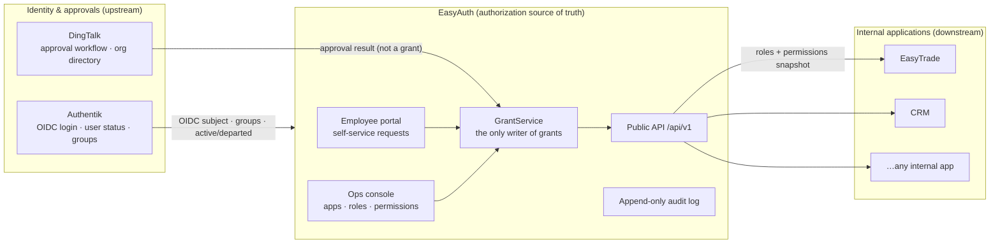

<div align="center">


# EasyAuth

**A centralized, self-service authorization layer for internal applications.**

Authentik owns identity. DingTalk runs approvals. EasyAuth is the single source of truth
for *what each user is allowed to do* inside every connected app — and a self-service portal
where employees request that access.

<sub>

**English** · [简体中文](./README.zh-CN.md)

</sub>

[](./LICENSE)
[](pyproject.toml)
[](pyproject.toml)
[](pyproject.toml)
[](frontend/package.json)
[](frontend/package.json)
[](frontend/src/i18n/messages.ts)


</div>

---

## Table of contents

- [What is EasyAuth?](#what-is-easyauth)
- [Where it sits](#where-it-sits-authentik--easyauth--your-apps)
- [Core concepts](#core-concepts)
- [Screenshots](#screenshots)
- [How your apps integrate](#how-your-apps-integrate)
- [Public API](#public-api)
- [Quick start (local development)](#quick-start-local-development)
- [Login & default admin credentials](#login--default-admin-credentials)
- [Connecting Authentik](#connecting-authentik)
- [Production deployment (manual)](#production-deployment-manual)
- [Deploy with an AI agent](#deploy-with-an-ai-agent)
- [Configuration reference](#configuration-reference)
- [Testing & quality gates](#testing--quality-gates)
- [Project layout](#project-layout)
- [Documentation](#documentation)
- [Roadmap](#roadmap)
- [Security](#security)
- [Contributing](#contributing)
- [License](#license)

---

## What is EasyAuth?

EasyAuth is a single-company, self-hosted **authorization** service. It does **not** replace
your identity provider or your approval workflow — it sits between them and gives every internal
application one stable answer to a single question:

> *"What roles and permissions does this user have in **my** app, right now?"*

The goal: a pilot internal application can onboard in **under one working day**, and from then on
never has to implement DingTalk approvals, role modeling, or permission logic itself.

### Highlights

- 🔐 **Authorization source of truth** — grants are written only by EasyAuth's `GrantService`;
  neither Authentik, DingTalk, nor downstream apps can forge an authorization fact.
- 🧑‍💼 **Self-service employee portal** — request roles/permissions, pick a validity window, see
  *My permissions*, *My requests*, and *Expiring soon*.
- 🧰 **Operations console** — model apps, roles, permissions, permission groups, approval rules,
  authorization scopes, credentials, and run live query tests.
- 🧩 **One-day onboarding** — a 6-step wizard plus a zero-dependency SDK that auto-registers an
  app and imports its permission catalog from a descriptor endpoint.
- 🪪 **Two credential types, one result** — static app tokens *and* OAuth2 client credentials
  resolve to the exact same authorization answer.
- 🔁 **Lifecycle automation** — Authentik sync revokes access on departure; Celery expires
  time-boxed grants; every security-sensitive action is written to an append-only audit log.
- 🌏 **Bilingual UI** — every screen ships in **简体中文** and **English**, toggled at runtime.

---

## Where it sits: Authentik → EasyAuth → your apps



**Rules of the road**

- **Authentik** is the authority for login identity, the public `user_id` (OIDC subject), and
  employment status. EasyAuth mirrors users but never invents them.
- **DingTalk** provides *only* the approval workflow and the org directory. An approval is a
  signal, **not** an authorization — EasyAuth applies the grant after approval.
- **EasyAuth** owns the authorization facts. Downstream apps read a snapshot and cache it locally;
  they must not call EasyAuth on every business query.

---

## Core concepts

| Term | Meaning |
| --- | --- |
| **Authorization fact / grant** | A user's current roles & permissions in one app. Written only by `GrantService`. |
| **App** | A connected internal application, identified by a stable `app_key`. |
| **Role / Permission** | `Role` is what employees request; `Permission` (e.g. `customer:view:department`) is the fine-grained capability an app consumes. |
| **Authorization scope** | The data/people boundary a permission applies to — e.g. `SELF`, `MANAGED`, `MANAGED_USERS`, `ALL`. |
| **`MANAGED_USERS`** | The resolved set of subordinate users a manager may act on, computed from the org relationship (first version: DingTalk manager chain). |
| **Downstream snapshot** | What a connected app pulls and stores locally: `version`, `expires_at`, grants, and resolved `MANAGED_USERS`. Business queries read the local snapshot only. |

See [`CONTEXT.md`](./CONTEXT.md) for the full domain glossary.

---

## Screenshots

> The UI ships bilingual. Set language at runtime from the globe menu in the top bar.

| Employee portal — request access | App onboarding wizard |
| --- | --- |
| [](docs/assets/screenshots/09-portal-request.png) | [](docs/assets/screenshots/06-onboarding-wizard.png) |

| Permission catalog (groups & scopes) | Integration guide (copy-paste API examples) |
| --- | --- |
| [](docs/assets/screenshots/03-app-catalog.png) | [](docs/assets/screenshots/05-app-guide.png) |

| Dependency health (upstream integrations) | Authorization groups / roles |
| --- | --- |
| [](docs/assets/screenshots/07-ops-health.png) | [](docs/assets/screenshots/04-app-matrix.png) |

| Local admin sign-in | Console in English |
| --- | --- |
| [](docs/assets/screenshots/01-login.png) | [](docs/assets/screenshots/11-console-apps-en.png) |

---

## How your apps integrate

An internal app onboards in three moves — most of it automated by the
[`easyauth-app-sdk`](sdk/python/README.md) (zero runtime dependencies; FastAPI helper optional).

**1. Expose a descriptor endpoint** — the downstream app publishes its metadata + permission
manifest at `GET /.well-known/easyauth-app.json`:

```python
from easyauth_app_sdk.fastapi import create_descriptor_router

def current_manifest() -> dict:
    # schema_version increments monotonically; each permission carries name / name_en (bilingual)
    ...

app.include_router(create_descriptor_router(current_manifest, token="optional-shared-secret"))
```

**2. Auto-onboard from the console** — in the *Onboarding wizard*, choose **Auto onboarding**,
fill in the downstream base URL + `app_key`, and EasyAuth pulls the descriptor to register the app
and import its permission catalog. No manual permission entry.

**3. Query permissions** — the app authenticates with its credential and asks EasyAuth what a user
can do, then caches the snapshot locally until `expires_at`:

```python
from easyauth_app_sdk import EasyAuthAppClient

client = EasyAuthAppClient(base_url="http://easyauth:8001", app_key="crm", token="eat_...")
snapshot = client.query_user_permissions("ak_uid_123")
# snapshot.roles, snapshot.permissions, snapshot.version, snapshot.expires_at
```

Employees, meanwhile, request access from the **portal** (choose app → role/permissions →
validity → reason). The request flows to DingTalk for approval; on approval EasyAuth writes the
grant, and the next permission query for that user reflects it.

---

## Public API

One versioned contract, `snake_case`, stable field semantics, paginated lists, unified errors.

### Query a user's permissions

```http
GET /api/v1/apps/{app_key}/users/{user_id}/permissions
Authorization: Bearer {app_token_or_oauth_access_token}
```

```json
{
  "user_id": "ak_uid_123",
  "app_key": "crm",
  "roles": ["sales_manager"],
  "permissions": ["customer:edit:own", "customer:view:department"],
  "version": 12,
  "expires_at": "2026-06-05T10:15:00Z"
}
```

- `user_id` is the Authentik UID / OIDC subject — never EasyAuth's internal DB id.
- Disabled / departed users and revoked / expired grants resolve to **empty** roles and
  permissions (existence is not leaked).
- `version` is a monotonic grant version for cache invalidation; `expires_at` is the **cache**
  deadline (default TTL 300s, max 900s), not the grant lifetime.
- Every successful query writes an `app_permission_queried` audit event.

### OAuth2 client credentials

```http
POST /oauth/token
Content-Type: application/x-www-form-urlencoded

grant_type=client_credentials&client_id={client_id}&client_secret={client_secret}
```

A static app token and an OAuth2 access token differ only in *authentication*; they yield the
**same** authorization result. Full contract:
[`docs/architecture/easyauth-architecture-design.md`](docs/architecture/easyauth-architecture-design.md).

---

## Quick start (local development)

**Prerequisites**

- Python **3.12**, [`uv`](https://docs.astral.sh/uv/) (or a plain `.venv`), Node ≥ 20 + `pnpm`,
  and Docker (for PostgreSQL/Redis — optional in dev, see below).

```bash
# 1. Clone
git clone <your-fork-or-mirror-url> EasyAuth && cd EasyAuth

# 2. Backend deps (creates .venv from uv.lock)
uv sync --extra dev
#    …or without uv:  python -m venv .venv && .venv/bin/pip install -e ".[dev]"

# 3. Frontend deps + build (outputs into src/easyauth/static/easyauth/frontend)
pnpm install
pnpm --filter @easyauth/frontend build

# 4. Database — dev uses SQLite automatically when DJANGO_DEBUG=1.
#    (For a Postgres-backed dev DB instead, run `docker compose up -d postgres redis`
#     and set DATABASE_URL — see the config reference below.)
DJANGO_DEBUG=1 .venv/bin/python manage.py migrate

# 5. Create the local admin (emergency channel, does not need Authentik)
DJANGO_DEBUG=1 .venv/bin/python manage.py create_local_admin admin --password admin123

# 6. Run the dev server (fixed on port 8001 for WebAuthn RP-ID reasons)
DJANGO_DEBUG=1 .venv/bin/python manage.py runserver 0.0.0.0:8001
```

Open **http://localhost:8001/** (always use `localhost`, not `127.0.0.1`, or passkeys break).

- Employee portal: `/portal/`
- Ops console: `/console/`
- Local admin sign-in: `/auth/local/`
- Health probe: `/health/`

> After changing backend code, templates, or the built frontend, **restart** the dev server and
> verify against a real HTTP response — a green build alone is not proof (see [`AGENTS.md`](./AGENTS.md)).

---

## Login & default admin credentials

EasyAuth has **two** ways in:

### 1. Work account (production path) — Authentik OIDC

`/auth/login/` → Authentik (→ DingTalk) → `/auth/callback/`. A user becomes a **console
super-admin** when their OIDC `groups` claim intersects `EASYAUTH_CONSOLE_SUPERUSER_GROUPS`
(default `EasyAuth Admins`). See [Connecting Authentik](#connecting-authentik).

### 2. Local super-admin (emergency channel) — password + 2FA

An Authentik-independent break-glass login at **`/auth/local/`**. This is the account you use to
bootstrap a fresh install before Authentik is wired up.

| Item | Value |
| --- | --- |
| **Default dev username** | `admin` |
| **Default dev password** | `admin123` |
| Sign-in page | `/auth/local/` |
| Second factor | `/auth/local/verify/` (TOTP authenticator or passkey; optional until you bind one) |
| Force-change password | `/auth/local/change-password/` (first login after create/reset) |
| Security settings (2FA, password) | `/auth/local/security/` |
| Create / reset | `.venv/bin/python manage.py create_local_admin <user> --password <pwd> [--update]` |

Behavior & guardrails:

- A freshly created account is flagged **must-change-password**: after first login every page
  redirects to the change-password screen until you set a new one (min 8 chars). Pass
  `--no-force-password-change` to skip.
- New password rules: current password correct, ≥ 8 chars, different from current, entered twice.
- Login is throttled (5 failures / 5 min per username, including 2FA and wrong current-password).
- Passkeys (WebAuthn) require browsing via `http://localhost:8001` in dev — `127.0.0.1` is not
  under RP-ID `localhost` and will fail (TOTP is unaffected).
- Every local-admin action is audited (`admin_local_login_succeeded`, `..._totp_enabled`, …).

> ⚠️ **`admin` / `admin123` is a development default only.** Before any shared or production
> deployment, create a strong-password admin and bind a second factor, or disable the account.

Full guide: [`docs/guides/local-admin-login.md`](docs/guides/local-admin-login.md).

---

## Connecting Authentik

EasyAuth expects an Authentik OAuth2/OIDC provider whose issuer serves the standard discovery,
JWKS, and end-session endpoints, plus an `easyauth_org` scope mapping that returns the user's
`groups` (and DingTalk org context). Minimal runtime config:

```bash
export EASYAUTH_AUTHENTIK_OIDC_ISSUER="https://auth.example.com/application/o/easyauth/"
export EASYAUTH_AUTHENTIK_OIDC_AUTHORIZATION_ENDPOINT="https://auth.example.com/application/o/authorize/"
export EASYAUTH_AUTHENTIK_OIDC_TOKEN_ENDPOINT="https://auth.example.com/application/o/token/"
export EASYAUTH_AUTHENTIK_OIDC_JWKS_URL="https://auth.example.com/application/o/easyauth/jwks/"
export EASYAUTH_AUTHENTIK_OIDC_CLIENT_ID="easyauth-portal"
export EASYAUTH_AUTHENTIK_OIDC_CLIENT_SECRET="<provider-client-secret>"
export EASYAUTH_AUTHENTIK_OIDC_REDIRECT_URI="https://easyauth.example.com/auth/callback/"
export EASYAUTH_AUTHENTIK_OIDC_SCOPES="openid profile email dingtalk easyauth_org"
export EASYAUTH_CONSOLE_SUPERUSER_GROUPS="EasyAuth Admins"
```

- **Automated / LLM-driven setup:** [`docs/guides/authentik-easyauth-automation-setup-llm.md`](docs/guides/authentik-easyauth-automation-setup-llm.md)
  — idempotent provider/application/scope-mapping/logout configuration with acceptance probes.
- **Manual UI setup:** [`docs/guides/authentik-easyauth-ui-setup-human.md`](docs/guides/authentik-easyauth-ui-setup-human.md).

Being in an Authentik *Application Binding* does **not** make someone an EasyAuth admin — admin
rights come exclusively from the `groups` claim intersecting `EASYAUTH_CONSOLE_SUPERUSER_GROUPS`.

---

## Production deployment (manual)

EasyAuth is a Django modular monolith: one web process (portal + console + API + callbacks),
PostgreSQL, Redis, and Celery worker/beat.

**1. Provision datastores** (or use managed equivalents):

```bash
EASYAUTH_POSTGRES_PASSWORD=<strong-pw> docker compose up -d postgres redis
```

**2. Set environment** (see the [configuration reference](#configuration-reference)) — at minimum
`DJANGO_SECRET_KEY`, `EASYAUTH_FIELD_ENCRYPTION_KEY`, `DATABASE_URL`, `DJANGO_ALLOWED_HOSTS`,
`DJANGO_CSRF_TRUSTED_ORIGINS`, the Authentik OIDC block, and Redis URLs. Keep `DJANGO_DEBUG=0`.

**3. Install & build:**

```bash
uv sync --extra dev
pnpm install && pnpm --filter @easyauth/frontend build   # emits into src/easyauth/static/…
.venv/bin/python manage.py migrate
.venv/bin/python manage.py create_local_admin admin --password "<strong-pw>"   # break-glass
```

**4. Run the app** with a WSGI/ASGI server:

```bash
# WSGI
.venv/bin/gunicorn easyauth.config.wsgi:application --bind 0.0.0.0:8001 --workers 4
# or ASGI
.venv/bin/uvicorn easyauth.config.asgi:application --host 0.0.0.0 --port 8001
```

**5. Run background workers:**

```bash
.venv/bin/celery -A easyauth.config worker  --loglevel=info   # Authentik sync, grant expiry, retries
.venv/bin/celery -A easyauth.config beat    --loglevel=info   # periodic schedules
```

**6. Front it with a reverse proxy (nginx/Caddy)** terminating TLS. The proxy must forward
`Host`, `X-Forwarded-Proto`, and `X-Forwarded-For`, and serve `/static/` directly from
`src/easyauth/static/` (the built React assets already live there — no `collectstatic` needed for
this layout). Set `EASYAUTH_TRUSTED_PROXY_HOPS` to match your proxy depth.

With `DJANGO_DEBUG=0` the app **fails fast** on missing critical config (secret key, encryption
key, `DATABASE_URL`) — this is intentional; there is no silent SQLite fallback in production.

---

## Deploy with an AI agent

Paste the block below into an autonomous coding agent (e.g. **Claude Code**) that has shell access
to your target host and this repository. It encodes the steps above with the project's real
commands and guardrails.

````text
You are deploying EasyAuth (a Django + React authorization service) from this repository.
Do NOT invent data, do NOT fall back to SQLite in production, and fail loudly on any missing
config. Work through these phases and verify each before moving on.

CONTEXT
- Backend: Django 5.2 (Python 3.12), served by gunicorn `easyauth.config.wsgi:application`.
- Frontend: React 19 + Vite, built into `src/easyauth/static/easyauth/frontend`.
- Datastores: PostgreSQL 16 + Redis 7 (see docker-compose.yml). Celery worker + beat required.
- Identity upstream is Authentik (OIDC); DingTalk provides approvals. EasyAuth is the
  authorization source of truth. Admin rights = OIDC `groups` ∩ EASYAUTH_CONSOLE_SUPERUSER_GROUPS.

PHASE 1 — Datastores
- Start Postgres + Redis: `EASYAUTH_POSTGRES_PASSWORD=<generate> docker compose up -d postgres redis`.
- Confirm both are healthy before continuing.

PHASE 2 — Environment (export or write to a secrets file, NEVER commit secrets)
- Generate strong random values for DJANGO_SECRET_KEY and EASYAUTH_FIELD_ENCRYPTION_KEY.
- Set DATABASE_URL=postgres://easyauth:<pw>@localhost:5432/easyauth
- Set DJANGO_DEBUG=0, DJANGO_ALLOWED_HOSTS, DJANGO_CSRF_TRUSTED_ORIGINS for the real domain.
- Set the Authentik OIDC block (issuer, authorization/token/jwks endpoints, client id/secret,
  redirect uri, scopes "openid profile email dingtalk easyauth_org") and
  EASYAUTH_CONSOLE_SUPERUSER_GROUPS="EasyAuth Admins".
- Set CELERY_BROKER_URL / CELERY_RESULT_BACKEND / EASYAUTH_CACHE_URL to the Redis instance.
- Set EASYAUTH_WEBAUTHN_RP_ID / _ORIGINS to the production domain.

PHASE 3 — Build & migrate
- `uv sync --extra dev`
- `pnpm install && pnpm --filter @easyauth/frontend build`
- `.venv/bin/python manage.py migrate`
- `.venv/bin/python manage.py check` and `migrate --check` must pass.

PHASE 4 — Bootstrap admin (break-glass)
- `.venv/bin/python manage.py create_local_admin admin --password "<generate-strong>"`
- Record the credential in the secret store; it forces a password change on first login.

PHASE 5 — Run
- Start gunicorn on 0.0.0.0:8001 (4 workers) and Celery worker + beat.
- Put nginx/Caddy in front: terminate TLS; forward Host, X-Forwarded-Proto, X-Forwarded-For;
  serve /static/ from src/easyauth/static/.

PHASE 6 — Wire Authentik
- Follow docs/guides/authentik-easyauth-automation-setup-llm.md to idempotently create the
  OAuth2/OIDC provider (client_id easyauth-portal), the EasyAuth application, the easyauth_org
  scope mapping (returns groups), and the logout invalidation binding.
- Run the acceptance probes in that guide (OIDC discovery, JWKS, /auth/login/ redirect,
  end-session). Do not print secrets to logs.

PHASE 7 — Verify
- `curl -fsS https://<domain>/health/` returns 200.
- `curl -I https://<domain>/auth/login/?next=/console/` redirects to Authentik authorize with
  client_id=easyauth-portal and the expected scopes.
- Sign in with an Authentik user in "EasyAuth Admins" and confirm /console/ admin actions work.
- Report the final URLs, the admin bootstrap location, and any manual follow-ups.
````

---

## Configuration reference

Set via environment variables. In `DJANGO_DEBUG=1` the starred rows use insecure dev defaults; in
production they are **required** and the app refuses to start without them.

| Variable | Required in prod | Purpose |
| --- | :---: | --- |
| `DJANGO_DEBUG` | — | `1` = local dev (SQLite, dev defaults). `0` = production. |
| `DJANGO_SECRET_KEY` | ★ | Django signing key. |
| `EASYAUTH_FIELD_ENCRYPTION_KEY` | ★ | Encrypts sensitive fields (Authentik token, TOTP seeds); independent of `SECRET_KEY`. |
| `DATABASE_URL` | ★ | `postgres://user:pw@host:5432/db`. No SQLite fallback in prod. |
| `DJANGO_ALLOWED_HOSTS` | ✓ | Comma-separated hostnames. |
| `DJANGO_CSRF_TRUSTED_ORIGINS` | ✓ | Comma-separated `https://…` origins. |
| `EASYAUTH_CACHE_URL` | ✓ | Redis cache URL (default `redis://localhost:6379/2`). |
| `CELERY_BROKER_URL` / `CELERY_RESULT_BACKEND` | ✓ | Redis for Celery (`/0`, `/1`). |
| `EASYAUTH_AUTHENTIK_OIDC_*` | ✓ | Issuer, authorization/token/JWKS endpoints, client id/secret, redirect URI, scopes. |
| `EASYAUTH_CONSOLE_SUPERUSER_GROUPS` | ✓ | Groups (from OIDC `groups`) that grant console super-admin. Default `EasyAuth Admins`. |
| `EASYAUTH_AUTHENTIK_BASE_URL` / `EASYAUTH_AUTHENTIK_API_TOKEN` | for directory sync | Authentik directory/API access. |
| `EASYAUTH_DINGTALK_CALLBACK_SECRET` | for approvals | Verifies DingTalk approval callbacks. |
| `EASYAUTH_WEBAUTHN_RP_ID` / `_RP_NAME` / `_ORIGINS` | for passkeys | WebAuthn relying-party config; must match the browser origin exactly. |
| `EASYAUTH_TRUSTED_PROXY_HOPS` | behind a proxy | Number of trusted reverse-proxy hops for client IP. |
| `DJANGO_SECURE_HSTS_SECONDS` | optional | HSTS max-age when `DEBUG=0` (default 3600). |

Additional tunables: `EASYAUTH_GRANT_EXPIRATION_CLEANUP_SECONDS`,
`EASYAUTH_DEPENDENCY_HEALTH_CHECK_SECONDS`, `EASYAUTH_DINGTALK_DIRECTORY_SYNC_SECONDS`,
`EASYAUTH_OAUTH_ACCESS_TOKEN_EXPIRE_SECONDS`, `EASYAUTH_AUTHENTIK_OIDC_HTTP_TIMEOUT_SECONDS`.

---

## Testing & quality gates

```bash
.venv/bin/python manage.py check
.venv/bin/python manage.py migrate --check
.venv/bin/pytest                                   # backend unit + integration
.venv/bin/ruff check .                             # lint
.venv/bin/basedpyright                             # types
pnpm --filter @easyauth/frontend test              # frontend unit (vitest)
pnpm --filter @easyauth/frontend build             # type-check + production build
pnpm --filter @easyauth/frontend e2e               # Playwright smoke
PYTHONPATH=sdk/python/src .venv/bin/pytest sdk/python/tests   # SDK
```

---

## Project layout

```text
EasyAuth/
├─ src/easyauth/
│  ├─ config/            # settings, URLs, WSGI/ASGI, Celery, middleware
│  ├─ accounts/          # Authentik login, local admin, user mirror & status sync
│  ├─ applications/      # App / Role / Permission / groups / approval rules / credentials
│  ├─ access_requests/   # AccessRequest state machine & employee request service
│  ├─ grants/            # AccessGrant — the only writer of authorization facts
│  ├─ api/               # DRF public API (/api/v1) — permission query, auth classes
│  ├─ integrations/      # authentik/ + dingtalk/ adapters (protocol, signature, payload)
│  ├─ portal/ · admin_console/   # employee portal & ops console (serve the React app)
│  ├─ audit/ · tasks/    # append-only audit log · Celery tasks
│  └─ static/            # built React assets land here
├─ frontend/             # React 19 + Vite + Tailwind SPA (bilingual i18n)
├─ sdk/python/           # easyauth-app-sdk (downstream integration, zero runtime deps)
├─ docs/                 # architecture, API, guides, decisions, plans (Chinese)
├─ tests/                # unit / integration / e2e
└─ docker-compose.yml    # PostgreSQL + Redis for local/prod datastores
```

---

## Documentation

Deep docs live in [`docs/`](docs/README.md) (authored in Chinese):

- **Architecture** — [`docs/architecture/easyauth-architecture-design.md`](docs/architecture/easyauth-architecture-design.md)
- **Authorization operations** — [`docs/architecture/easyauth-authorization-operations-design.md`](docs/architecture/easyauth-authorization-operations-design.md)
- **Public API design** — [`docs/api/`](docs/api/)
- **Authentik setup** — [automation (LLM)](docs/guides/authentik-easyauth-automation-setup-llm.md) · [manual (human)](docs/guides/authentik-easyauth-ui-setup-human.md)
- **App onboarding** — [wizard](docs/guides/easyauth-app-onboarding-wizard.md) · [SDK integration](docs/guides/easyauth-app-sdk-integration.md)
- **Local admin login** — [`docs/guides/local-admin-login.md`](docs/guides/local-admin-login.md)
- **Domain glossary** — [`CONTEXT.md`](./CONTEXT.md) · **Contributor rules** — [`AGENTS.md`](./AGENTS.md)

---

## Roadmap

Delivered in phases (`MVP-*` foundation, `OPS-*` operations enhancements):

- **MVP** — engineering baseline → stable permission-query API → identity/approval/grant lifecycle → portal + pilot onboarding.
- **OPS-1** — configuration completeness & onboarding/integration testing.
- **OPS-2** — employee authorization portal (*My permissions / My requests / Expiring soon*).
- **OPS-3** — operations dashboards, failure recovery, emergency revoke, dependency health, audit filtering.
- **OPS-4** — change / revoke / renewal requests.

---

## Security

- Grants are written only by `GrantService`; a DingTalk approval never directly grants access, and
  emergency revoke can only *reduce* access.
- App tokens and OAuth secrets are stored hashed / never logged in plaintext; a credential binds to
  exactly one app, and the path `app_key` must match the credential's app.
- All external input (DingTalk callbacks, Authentik payloads, portal/console forms, app requests)
  is validated at the boundary before it can influence an authorization decision.
- The audit log is append-only. Found a vulnerability? Please disclose it privately to the
  maintainers rather than opening a public issue.

---

## Contributing

Issues and pull requests are welcome. Before submitting, please run the
[quality gates](#testing--quality-gates), keep changes within the module boundaries described in
the architecture doc, and note that **documentation under `docs/` is authored in Chinese** per
[`AGENTS.md`](./AGENTS.md) (this README is intentionally bilingual for open-source consumers).

---

## License

Licensed under the **[Apache License 2.0](./LICENSE)**.

EasyAuth is an internal enterprise application that is also open source — **you are free to use,
modify, and distribute it**, including commercially, subject to the license terms (which include an
explicit patent grant). See [`LICENSE`](./LICENSE) and [`NOTICE`](./NOTICE).

```
Copyright 2026 Jiefa (捷发)
```
