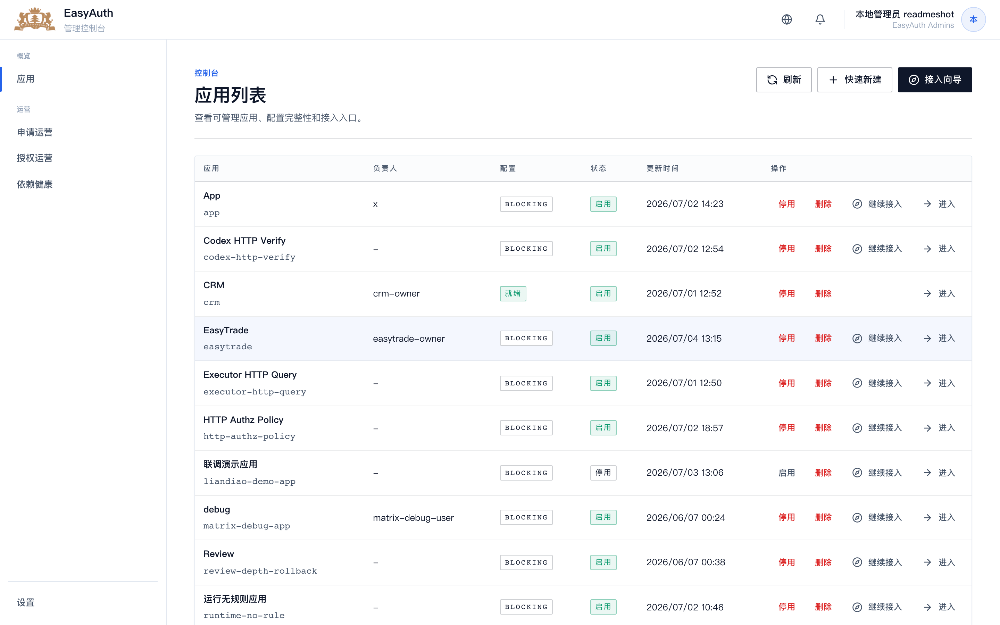
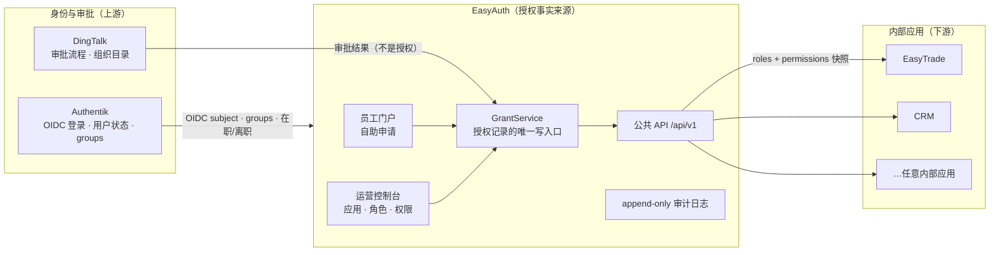
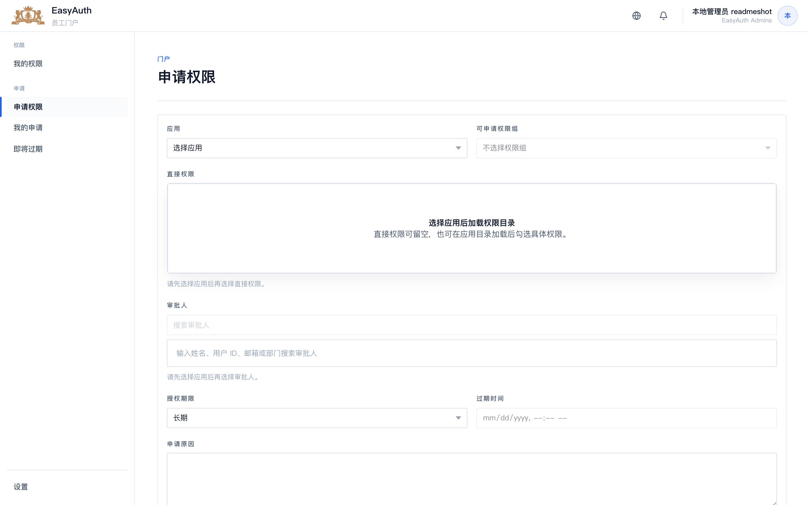
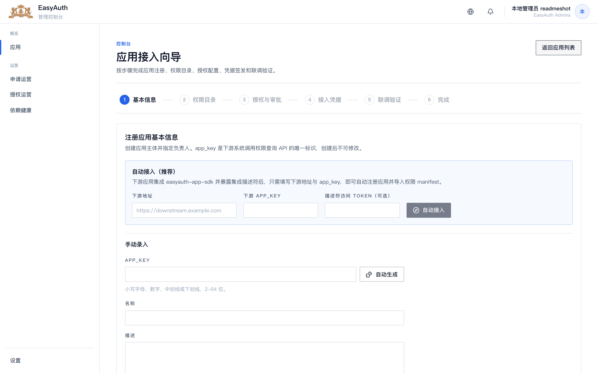
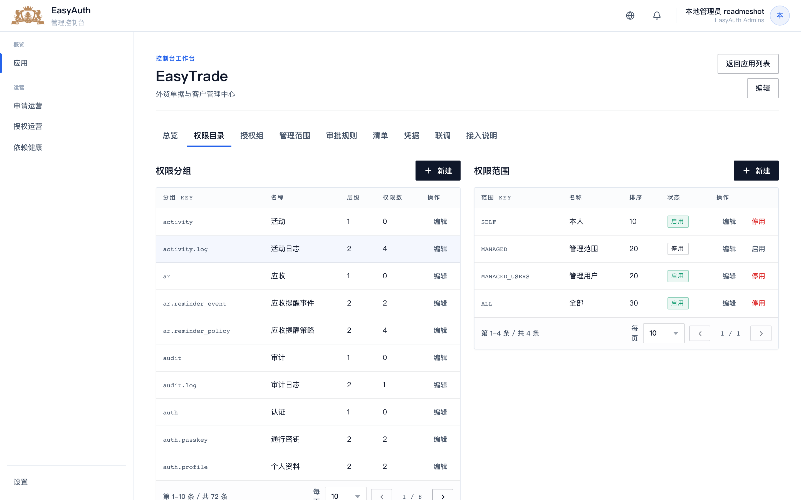
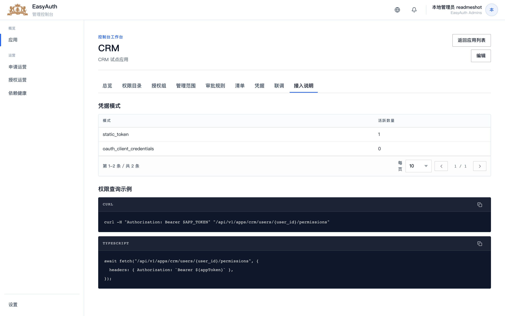
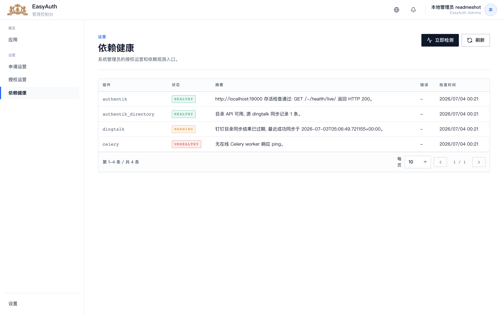
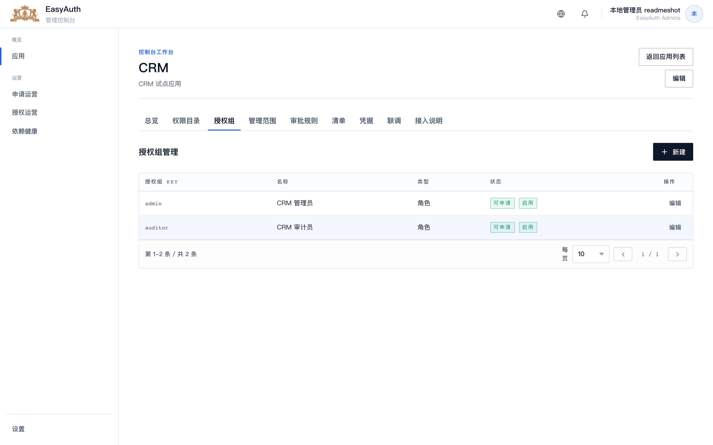
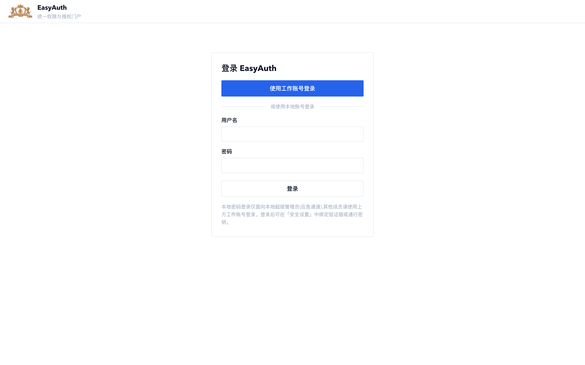
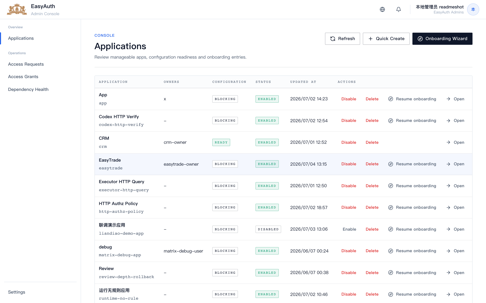

<div align="center">


# EasyAuth

**面向内部应用的集中式自助授权层。**

Authentik 负责身份认证，DingTalk 负责审批流程，EasyAuth 是每个已接入应用里
*「用户到底能做什么」* 的唯一事实来源，同时也是员工发起访问申请的自助门户。

<sub>

[English](./README.md) · **简体中文**

</sub>

[](./LICENSE)
[](pyproject.toml)
[](pyproject.toml)
[](pyproject.toml)
[](frontend/package.json)
[](frontend/package.json)
[](frontend/src/i18n/messages.ts)



</div>

---

## 目录

- [EasyAuth 是什么](#easyauth-是什么)
- [它在体系中的位置](#它在体系中的位置authentik--easyauth--你的应用)
- [核心概念](#核心概念)
- [界面截图](#界面截图)
- [下游应用如何接入](#下游应用如何接入)
- [公共 API](#公共-api)
- [快速开始（本地开发）](#快速开始本地开发)
- [登录与默认管理员凭据](#登录与默认管理员凭据)
- [接入 Authentik](#接入-authentik)
- [生产部署（手动）](#生产部署手动)
- [用 AI Agent 部署](#用-ai-agent-部署)
- [配置参考](#配置参考)
- [测试与质量门槛](#测试与质量门槛)
- [项目结构](#项目结构)
- [文档](#文档)
- [阶段路线图](#阶段路线图)
- [安全](#安全)
- [参与贡献](#参与贡献)
- [许可证](#许可证)

---

## EasyAuth 是什么

EasyAuth 是**单公司、自托管**的**授权**服务。它不替代身份提供方，也不替代审批流程——
它位于两者之间，让每个内部应用只需回答一个问题就能拿到稳定答案：

> *「这个用户此刻在**我这个应用**里拥有哪些角色和权限？」*

目标是：试点内部应用能在**一个工作日内**接入，此后不必再自己实现 DingTalk 审批、角色建模或权限逻辑。

### 亮点

- 🔐 **授权事实的唯一来源** —— 授权记录只能由 EasyAuth 的 `GrantService` 写入；
  Authentik、DingTalk、下游应用都无法伪造一条授权事实。
- 🧑‍💼 **员工自助门户** —— 申请角色/权限、选择有效期，查看「我的权限 / 我的申请 / 即将过期」。
- 🧰 **运营控制台** —— 建模应用、角色、权限、权限分组、审批规则、授权范围、凭据，并可现场联调查询。
- 🧩 **一天接入** —— 6 步接入向导，配合零依赖 SDK，从描述符端点自动注册应用并导入权限目录。
- 🪪 **两种凭据，同一结果** —— 静态 app token 与 OAuth2 client credentials 得到**完全一致**的授权结果。
- 🔁 **生命周期自动化** —— Authentik 同步在离职时撤权；Celery 清理限时授权；每个安全敏感动作写入 append-only 审计日志。
- 🌏 **双语界面** —— 每个页面都提供**简体中文**与**English**，可运行时切换。

---

## 它在体系中的位置：Authentik → EasyAuth → 你的应用



**基本规则**

- **Authentik** 是登录身份、公共 `user_id`（OIDC subject）和在职状态的权威来源。EasyAuth 镜像用户，从不凭空创造用户。
- **DingTalk** 只提供审批流程和组织目录。审批只是信号，**不是**授权——审批通过后由 EasyAuth 落库授权。
- **EasyAuth** 拥有授权事实。下游应用拉取快照后落地本地缓存，不得在每次业务查询时实时调用 EasyAuth。

---

## 核心概念

| 术语 | 含义 |
| --- | --- |
| **授权事实 / 授权记录** | 用户在某应用当前的角色与权限，只能由 `GrantService` 写入。 |
| **App** | 一个已接入的内部应用，由稳定的 `app_key` 标识。 |
| **Role / Permission** | `Role` 是员工申请的单元；`Permission`（如 `customer:view:department`）是应用消费的细粒度能力。 |
| **授权范围** | 权限作用的数据/人员边界，如 `SELF`、`MANAGED`、`MANAGED_USERS`、`ALL`。 |
| **`MANAGED_USERS`** | 当前用户在指定权限下可管理的下级人员集合，由组织关系解析得到（第一版：钉钉主管链）。 |
| **下游授权快照** | 接入应用拉取并落地的内容：`version`、`expires_at`、授权列表和解析后的 `MANAGED_USERS`；业务查询只依赖本地快照。 |

完整领域词表见 [`CONTEXT.md`](./CONTEXT.md)。

---

## 界面截图

> 界面为双语，可在顶栏地球图标菜单里运行时切换语言。

| 员工门户 —— 申请权限 | 应用接入向导 |
| --- | --- |
| [](docs/assets/screenshots/09-portal-request.png) | [](docs/assets/screenshots/06-onboarding-wizard.png) |

| 权限目录（分组与范围） | 接入说明（可复制的 API 示例） |
| --- | --- |
| [](docs/assets/screenshots/03-app-catalog.png) | [](docs/assets/screenshots/05-app-guide.png) |

| 依赖健康（上游集成状态） | 授权组 / 角色 |
| --- | --- |
| [](docs/assets/screenshots/07-ops-health.png) | [](docs/assets/screenshots/04-app-matrix.png) |

| 本地管理员登录 | 英文界面 |
| --- | --- |
| [](docs/assets/screenshots/01-login.png) | [](docs/assets/screenshots/11-console-apps-en.png) |

---

## 下游应用如何接入

一个内部应用接入分三步——大部分由
[`easyauth-app-sdk`](sdk/python/README.md) 自动完成（零运行时依赖，FastAPI 集成为可选 extra）。

**1. 暴露描述符端点** —— 下游应用在 `GET /.well-known/easyauth-app.json` 发布元数据 + 权限 manifest：

```python
from easyauth_app_sdk.fastapi import create_descriptor_router

def current_manifest() -> dict:
    # schema_version 单调递增；每个权限携带 name / name_en（双语显示名）
    ...

app.include_router(create_descriptor_router(current_manifest, token="可选共享密钥"))
```

**2. 控制台自动接入** —— 在「接入向导」里选择 **自动接入**，填写下游地址 + `app_key`，
EasyAuth 拉取描述符，自动注册应用并导入权限目录，无需手工录入权限。

**3. 查询权限** —— 应用用自身凭据向 EasyAuth 查询用户能做什么，并把快照缓存到本地直到 `expires_at`：

```python
from easyauth_app_sdk import EasyAuthAppClient

client = EasyAuthAppClient(base_url="http://easyauth:8001", app_key="crm", token="eat_...")
snapshot = client.query_user_permissions("ak_uid_123")
# snapshot.roles, snapshot.permissions, snapshot.version, snapshot.expires_at
```

与此同时，员工在**门户**发起申请（选择应用 → 角色/权限 → 有效期 → 原因）。申请进入 DingTalk 审批；
审批通过后 EasyAuth 写入授权，该用户的下一次权限查询即刻生效。

---

## 公共 API

一个版本化契约，`snake_case`，字段语义稳定，列表分页，统一错误结构。

### 查询用户权限

```http
GET /api/v1/apps/{app_key}/users/{user_id}/permissions
Authorization: Bearer {app_token_or_oauth_access_token}
```

```json
{
  "user_id": "ak_uid_123",
  "app_key": "crm",
  "roles": ["sales_manager"],
  "permissions": ["customer:edit:own", "customer:view:department"],
  "version": 12,
  "expires_at": "2026-06-05T10:15:00Z"
}
```

- `user_id` 是 Authentik UID / OIDC subject，绝不暴露 EasyAuth 内部数据库 ID。
- disabled / departed 用户、revoked / expired 授权都解析为**空** roles 和 permissions（不泄露用户存在性）。
- `version` 是单调递增的授权版本，用于缓存失效判断；`expires_at` 是**缓存**过期时间（默认 TTL 300 秒，最大 900 秒），不是授权生命周期。
- 每次成功查询写入 `app_permission_queried` 审计事件。

### OAuth2 client credentials

```http
POST /oauth/token
Content-Type: application/x-www-form-urlencoded

grant_type=client_credentials&client_id={client_id}&client_secret={client_secret}
```

静态 app token 与 OAuth2 access token 仅在*认证方式*上不同，得到的**授权结果一致**。完整契约见
[`docs/architecture/easyauth-architecture-design.md`](docs/architecture/easyauth-architecture-design.md)。

---

## 快速开始（本地开发）

**前置依赖**

- Python **3.12**、[`uv`](https://docs.astral.sh/uv/)（或普通 `.venv`）、Node ≥ 20 + `pnpm`，
  以及 Docker（用于 PostgreSQL/Redis——开发可选，见下）。

```bash
# 1. 克隆
git clone <你的仓库地址> EasyAuth && cd EasyAuth

# 2. 后端依赖（依据 uv.lock 创建 .venv）
uv sync --extra dev
#    …不用 uv：  python -m venv .venv && .venv/bin/pip install -e ".[dev]"

# 3. 前端依赖 + 构建（产物输出到 src/easyauth/static/easyauth/frontend）
pnpm install
pnpm --filter @easyauth/frontend build

# 4. 数据库——DJANGO_DEBUG=1 时开发环境自动使用 SQLite。
#    （若想用 Postgres 开发库：`docker compose up -d postgres redis` 并设置 DATABASE_URL，见下方配置参考）
DJANGO_DEBUG=1 .venv/bin/python manage.py migrate

# 5. 创建本地管理员（应急通道，不依赖 Authentik）
DJANGO_DEBUG=1 .venv/bin/python manage.py create_local_admin admin --password admin123

# 6. 启动开发服务（固定 8001 端口，因 WebAuthn RP-ID 约束）
DJANGO_DEBUG=1 .venv/bin/python manage.py runserver 0.0.0.0:8001
```

打开 **http://localhost:8001/**（务必用 `localhost` 而非 `127.0.0.1`，否则通行密钥失效）。

- 员工门户：`/portal/`
- 运营控制台：`/console/`
- 本地管理员登录：`/auth/local/`
- 健康探针：`/health/`

> 修改后端代码、模板或前端构建产物后，必须**重启**开发服务，并用真实 HTTP 响应验证——
> 仅构建成功不算完成（见 [`AGENTS.md`](./AGENTS.md)）。

---

## 登录与默认管理员凭据

EasyAuth 有**两条**登录路径：

### 1. 工作账号（生产路径）—— Authentik OIDC

`/auth/login/` → Authentik（→ DingTalk）→ `/auth/callback/`。当用户 OIDC `groups` claim 与
`EASYAUTH_CONSOLE_SUPERUSER_GROUPS`（默认 `EasyAuth Admins`）有交集时，即成为**控制台超级管理员**。
详见 [接入 Authentik](#接入-authentik)。

### 2. 本地超级管理员（应急通道）—— 密码 + 二次验证

一条不依赖 Authentik 的兜底登录：**`/auth/local/`**。在 Authentik 尚未接好之前，用它来引导全新部署。

| 项 | 值 |
| --- | --- |
| **默认开发用户名** | `admin` |
| **默认开发密码** | `admin123` |
| 登录页 | `/auth/local/` |
| 二次验证 | `/auth/local/verify/`（TOTP 验证器或通行密钥；未绑定前可跳过） |
| 强制改密 | `/auth/local/change-password/`（新建/重置后首次登录） |
| 安全设置（2FA、改密） | `/auth/local/security/` |
| 创建 / 重置 | `.venv/bin/python manage.py create_local_admin <用户名> --password <密码> [--update]` |

行为与护栏：

- 新建账号默认带 **must-change-password** 标记：首次登录后所有页面都会跳转到改密页，直到设置新密码（≥ 8 位）；
  加 `--no-force-password-change` 可跳过。
- 改密要求：当前密码正确、≥ 8 位、与当前密码不同、两次一致。
- 登录按用户名节流（5 次 / 5 分钟，含二次验证失败与改密时当前密码错误）。
- 通行密钥（WebAuthn）开发时必须用 `http://localhost:8001` 访问——`127.0.0.1` 不属于 RP-ID `localhost` 会失败（TOTP 不受影响）。
- 每个本地管理员动作都会审计（`admin_local_login_succeeded`、`..._totp_enabled` 等）。

> ⚠️ **`admin` / `admin123` 仅为开发默认值。** 任何共享或生产部署前，请创建强密码管理员并绑定二次验证，或停用该账号。

完整指南：[`docs/guides/local-admin-login.md`](docs/guides/local-admin-login.md)。

---

## 接入 Authentik

EasyAuth 期望一个 Authentik OAuth2/OIDC Provider，其 issuer 提供标准的 discovery、JWKS、end-session 端点，
并配置一个返回用户 `groups`（及钉钉组织上下文）的 `easyauth_org` scope mapping。最小运行配置：

```bash
export EASYAUTH_AUTHENTIK_OIDC_ISSUER="https://auth.example.com/application/o/easyauth/"
export EASYAUTH_AUTHENTIK_OIDC_AUTHORIZATION_ENDPOINT="https://auth.example.com/application/o/authorize/"
export EASYAUTH_AUTHENTIK_OIDC_TOKEN_ENDPOINT="https://auth.example.com/application/o/token/"
export EASYAUTH_AUTHENTIK_OIDC_JWKS_URL="https://auth.example.com/application/o/easyauth/jwks/"
export EASYAUTH_AUTHENTIK_OIDC_CLIENT_ID="easyauth-portal"
export EASYAUTH_AUTHENTIK_OIDC_CLIENT_SECRET="<provider-client-secret>"
export EASYAUTH_AUTHENTIK_OIDC_REDIRECT_URI="https://easyauth.example.com/auth/callback/"
export EASYAUTH_AUTHENTIK_OIDC_SCOPES="openid profile email dingtalk easyauth_org"
export EASYAUTH_CONSOLE_SUPERUSER_GROUPS="EasyAuth Admins"
```

- **自动化 / LLM 驱动配置：** [`docs/guides/authentik-easyauth-automation-setup-llm.md`](docs/guides/authentik-easyauth-automation-setup-llm.md)
  —— 幂等地配置 Provider/Application/scope mapping/logout，并附验收探测。
- **手动 UI 配置：** [`docs/guides/authentik-easyauth-ui-setup-human.md`](docs/guides/authentik-easyauth-ui-setup-human.md)。

处于 Authentik *Application Binding* **不会**使某人成为 EasyAuth 管理员——管理员权限只来自
`groups` claim 与 `EASYAUTH_CONSOLE_SUPERUSER_GROUPS` 的交集。

---

## 生产部署（手动）

EasyAuth 是 Django 模块化单体：一个 web 进程（门户 + 控制台 + API + 回调）、PostgreSQL、Redis，以及 Celery worker/beat。

**1. 准备数据存储**（或使用托管等价物）：

```bash
EASYAUTH_POSTGRES_PASSWORD=<强密码> docker compose up -d postgres redis
```

**2. 设置环境变量**（见[配置参考](#配置参考)）——至少包括
`DJANGO_SECRET_KEY`、`EASYAUTH_FIELD_ENCRYPTION_KEY`、`DATABASE_URL`、`DJANGO_ALLOWED_HOSTS`、
`DJANGO_CSRF_TRUSTED_ORIGINS`、Authentik OIDC 配置块，以及 Redis URL。保持 `DJANGO_DEBUG=0`。

**3. 安装与构建：**

```bash
uv sync --extra dev
pnpm install && pnpm --filter @easyauth/frontend build   # 输出到 src/easyauth/static/…
.venv/bin/python manage.py migrate
.venv/bin/python manage.py create_local_admin admin --password "<强密码>"   # 应急账号
```

**4. 用 WSGI/ASGI 服务器运行：**

```bash
# WSGI
.venv/bin/gunicorn easyauth.config.wsgi:application --bind 0.0.0.0:8001 --workers 4
# 或 ASGI
.venv/bin/uvicorn easyauth.config.asgi:application --host 0.0.0.0 --port 8001
```

**5. 运行后台任务：**

```bash
.venv/bin/celery -A easyauth.config worker  --loglevel=info   # Authentik 同步、授权过期、重试
.venv/bin/celery -A easyauth.config beat    --loglevel=info   # 定时调度
```

**6. 前置反向代理（nginx/Caddy）** 终止 TLS。代理必须透传
`Host`、`X-Forwarded-Proto`、`X-Forwarded-For`，并直接从 `src/easyauth/static/` 提供 `/static/`
（构建后的 React 产物已在此目录——该布局无需 `collectstatic`）。按代理层数设置 `EASYAUTH_TRUSTED_PROXY_HOPS`。

当 `DJANGO_DEBUG=0` 时，缺失关键配置（secret key、加密 key、`DATABASE_URL`）会**快速失败**——
这是刻意设计，生产环境不存在静默回退 SQLite。

---

## 用 AI Agent 部署

把下面这段粘贴给一个具备目标主机与本仓库 shell 权限的自主编码 Agent（如 **Claude Code**）。
它用项目真实命令和护栏编码了上述步骤。

````text
你正在从本仓库部署 EasyAuth（一个 Django + React 授权服务）。
不得编造数据，不得在生产回退 SQLite，任何缺失配置都要显式报错。逐阶段执行并在推进前验证。

背景
- 后端：Django 5.2（Python 3.12），由 gunicorn `easyauth.config.wsgi:application` 提供。
- 前端：React 19 + Vite，构建到 `src/easyauth/static/easyauth/frontend`。
- 数据存储：PostgreSQL 16 + Redis 7（见 docker-compose.yml）。需要 Celery worker + beat。
- 身份上游是 Authentik（OIDC）；DingTalk 提供审批。EasyAuth 是授权事实来源。
  管理员权限 = OIDC `groups` ∩ EASYAUTH_CONSOLE_SUPERUSER_GROUPS。

阶段 1 — 数据存储
- 启动 Postgres + Redis：`EASYAUTH_POSTGRES_PASSWORD=<生成> docker compose up -d postgres redis`。
- 确认两者 healthy 再继续。

阶段 2 — 环境变量（export 或写入 secrets 文件，绝不提交密钥）
- 为 DJANGO_SECRET_KEY 和 EASYAUTH_FIELD_ENCRYPTION_KEY 生成强随机值。
- 设置 DATABASE_URL=postgres://easyauth:<pw>@localhost:5432/easyauth
- 设置 DJANGO_DEBUG=0，以及真实域名的 DJANGO_ALLOWED_HOSTS、DJANGO_CSRF_TRUSTED_ORIGINS。
- 设置 Authentik OIDC 配置块（issuer、authorization/token/jwks 端点、client id/secret、
  redirect uri、scopes "openid profile email dingtalk easyauth_org"）以及
  EASYAUTH_CONSOLE_SUPERUSER_GROUPS="EasyAuth Admins"。
- 设置 CELERY_BROKER_URL / CELERY_RESULT_BACKEND / EASYAUTH_CACHE_URL 指向 Redis。
- 设置 EASYAUTH_WEBAUTHN_RP_ID / _ORIGINS 为生产域名。

阶段 3 — 构建与迁移
- `uv sync --extra dev`
- `pnpm install && pnpm --filter @easyauth/frontend build`
- `.venv/bin/python manage.py migrate`
- `.venv/bin/python manage.py check` 与 `migrate --check` 必须通过。

阶段 4 — 引导管理员（应急）
- `.venv/bin/python manage.py create_local_admin admin --password "<生成强密码>"`
- 把凭据记入密钥库；首次登录会强制改密。

阶段 5 — 运行
- 在 0.0.0.0:8001 启动 gunicorn（4 workers），并启动 Celery worker + beat。
- 前置 nginx/Caddy：终止 TLS；透传 Host、X-Forwarded-Proto、X-Forwarded-For；
  从 src/easyauth/static/ 提供 /static/。

阶段 6 — 接入 Authentik
- 按 docs/guides/authentik-easyauth-automation-setup-llm.md 幂等创建
  OAuth2/OIDC Provider（client_id easyauth-portal）、EasyAuth Application、
  easyauth_org scope mapping（返回 groups），以及 logout invalidation 绑定。
- 运行该指南中的验收探测（OIDC discovery、JWKS、/auth/login/ 跳转、end-session）。不要把密钥打印到日志。

阶段 7 — 验证
- `curl -fsS https://<域名>/health/` 返回 200。
- `curl -I https://<域名>/auth/login/?next=/console/` 跳转到 Authentik authorize，
  带 client_id=easyauth-portal 与预期 scopes。
- 用属于 "EasyAuth Admins" 的 Authentik 用户登录，确认 /console/ 管理动作可用。
- 汇报最终 URL、管理员引导凭据位置，以及需要人工跟进的项。
````

---

## 配置参考

通过环境变量设置。`DJANGO_DEBUG=1` 时带 ★ 的项使用不安全的开发默认值；生产环境这些项**必填**，缺失则拒绝启动。

| 变量 | 生产必填 | 用途 |
| --- | :---: | --- |
| `DJANGO_DEBUG` | — | `1` = 本地开发（SQLite、开发默认值）。`0` = 生产。 |
| `DJANGO_SECRET_KEY` | ★ | Django 签名密钥。 |
| `EASYAUTH_FIELD_ENCRYPTION_KEY` | ★ | 加密敏感字段（Authentik token、TOTP 种子）；与 `SECRET_KEY` 独立。 |
| `DATABASE_URL` | ★ | `postgres://user:pw@host:5432/db`。生产不回退 SQLite。 |
| `DJANGO_ALLOWED_HOSTS` | ✓ | 逗号分隔的主机名。 |
| `DJANGO_CSRF_TRUSTED_ORIGINS` | ✓ | 逗号分隔的 `https://…` 来源。 |
| `EASYAUTH_CACHE_URL` | ✓ | Redis 缓存 URL（默认 `redis://localhost:6379/2`）。 |
| `CELERY_BROKER_URL` / `CELERY_RESULT_BACKEND` | ✓ | Celery 用 Redis（`/0`、`/1`）。 |
| `EASYAUTH_AUTHENTIK_OIDC_*` | ✓ | issuer、authorization/token/JWKS 端点、client id/secret、redirect URI、scopes。 |
| `EASYAUTH_CONSOLE_SUPERUSER_GROUPS` | ✓ | 授予控制台超管的 groups（来自 OIDC `groups`）。默认 `EasyAuth Admins`。 |
| `EASYAUTH_AUTHENTIK_BASE_URL` / `EASYAUTH_AUTHENTIK_API_TOKEN` | 目录同步需要 | Authentik 目录/API 访问。 |
| `EASYAUTH_DINGTALK_CALLBACK_SECRET` | 审批需要 | 校验 DingTalk 审批回调。 |
| `EASYAUTH_WEBAUTHN_RP_ID` / `_RP_NAME` / `_ORIGINS` | 通行密钥需要 | WebAuthn RP 配置；必须与浏览器地址栏完全一致。 |
| `EASYAUTH_TRUSTED_PROXY_HOPS` | 反代后需要 | 可信反向代理层数，用于解析客户端 IP。 |
| `DJANGO_SECURE_HSTS_SECONDS` | 可选 | `DEBUG=0` 时的 HSTS max-age（默认 3600）。 |

其它可调项：`EASYAUTH_GRANT_EXPIRATION_CLEANUP_SECONDS`、
`EASYAUTH_DEPENDENCY_HEALTH_CHECK_SECONDS`、`EASYAUTH_DINGTALK_DIRECTORY_SYNC_SECONDS`、
`EASYAUTH_OAUTH_ACCESS_TOKEN_EXPIRE_SECONDS`、`EASYAUTH_AUTHENTIK_OIDC_HTTP_TIMEOUT_SECONDS`。

---

## 测试与质量门槛

```bash
.venv/bin/python manage.py check
.venv/bin/python manage.py migrate --check
.venv/bin/pytest                                   # 后端单元 + 集成
.venv/bin/ruff check .                             # lint
.venv/bin/basedpyright                             # 类型检查
pnpm --filter @easyauth/frontend test              # 前端单元（vitest）
pnpm --filter @easyauth/frontend build             # 类型检查 + 生产构建
pnpm --filter @easyauth/frontend e2e               # Playwright 冒烟
PYTHONPATH=sdk/python/src .venv/bin/pytest sdk/python/tests   # SDK
```

---

## 项目结构

```text
EasyAuth/
├─ src/easyauth/
│  ├─ config/            # settings、URLs、WSGI/ASGI、Celery、middleware
│  ├─ accounts/          # Authentik 登录、本地管理员、用户镜像与状态同步
│  ├─ applications/      # App / Role / Permission / 分组 / 审批规则 / 凭据
│  ├─ access_requests/   # AccessRequest 状态机与员工申请服务
│  ├─ grants/            # AccessGrant —— 授权事实的唯一写入口
│  ├─ api/               # DRF 公共 API（/api/v1）—— 权限查询、认证类
│  ├─ integrations/      # authentik/ + dingtalk/ 适配器（协议、签名、payload）
│  ├─ portal/ · admin_console/   # 员工门户与运营控制台（承载 React 应用）
│  ├─ audit/ · tasks/    # append-only 审计日志 · Celery 任务
│  └─ static/            # 构建后的 React 产物落在此处
├─ frontend/             # React 19 + Vite + Tailwind SPA（双语 i18n）
├─ sdk/python/           # easyauth-app-sdk（下游接入，零运行时依赖）
├─ docs/                 # 架构、API、指南、决策、计划（中文）
├─ tests/                # 单元 / 集成 / e2e
└─ docker-compose.yml    # 本地/生产数据存储 PostgreSQL + Redis
```

---

## 文档

深入文档见 [`docs/`](docs/README.md)（中文撰写）：

- **架构** —— [`docs/architecture/easyauth-architecture-design.md`](docs/architecture/easyauth-architecture-design.md)
- **业务授权运营** —— [`docs/architecture/easyauth-authorization-operations-design.md`](docs/architecture/easyauth-authorization-operations-design.md)
- **公共 API 设计** —— [`docs/api/`](docs/api/)
- **Authentik 配置** —— [自动化（LLM）](docs/guides/authentik-easyauth-automation-setup-llm.md) · [手动（人工）](docs/guides/authentik-easyauth-ui-setup-human.md)
- **应用接入** —— [接入向导](docs/guides/easyauth-app-onboarding-wizard.md) · [SDK 集成](docs/guides/easyauth-app-sdk-integration.md)
- **本地管理员登录** —— [`docs/guides/local-admin-login.md`](docs/guides/local-admin-login.md)
- **领域词表** —— [`CONTEXT.md`](./CONTEXT.md) · **协作规则** —— [`AGENTS.md`](./AGENTS.md)

---

## 阶段路线图

分阶段交付（`MVP-*` 基础，`OPS-*` 运营增强）：

- **MVP** —— 工程基线 → 稳定权限查询 API → 身份/审批/授权生命周期 → 门户 + 试点接入。
- **OPS-1** —— 配置完整性与接入联调。
- **OPS-2** —— 员工授权门户（*我的权限 / 我的申请 / 即将过期*）。
- **OPS-3** —— 运营看板、失败恢复、紧急撤权、依赖健康、审计筛选。
- **OPS-4** —— 变更 / 撤销 / 续期申请。

---

## 安全

- 授权记录只能由 `GrantService` 写入；DingTalk 审批从不直接授予权限，紧急撤权只能*减少*访问。
- app token 与 OAuth secret 以 hash 存储、绝不明文记录；一条凭据只绑定一个应用，路径 `app_key` 必须与凭据所属应用一致。
- 所有外部输入（DingTalk 回调、Authentik payload、门户/控制台表单、应用请求）都在边界处校验，之后才能影响授权决策。
- 审计日志 append-only。发现漏洞？请私下向维护者披露，而非公开 issue。

---

## 参与贡献

欢迎提交 issue 与 PR。提交前请运行[质量门槛](#测试与质量门槛)，把改动控制在架构文档描述的模块边界内，
并注意 **`docs/` 下的文档以中文撰写**（见 [`AGENTS.md`](./AGENTS.md)；本 README 为面向开源使用者而有意做成双语）。

---

## 许可证

采用 **[Apache License 2.0](./LICENSE)**。

EasyAuth 是一款企业内部应用，同时开源——**你可以自由使用、修改和分发**（包括商用），
遵循许可证条款即可（其中含明确的专利授权）。详见 [`LICENSE`](./LICENSE) 与 [`NOTICE`](./NOTICE)。

```
Copyright 2026 Jiefa (捷发)
```
