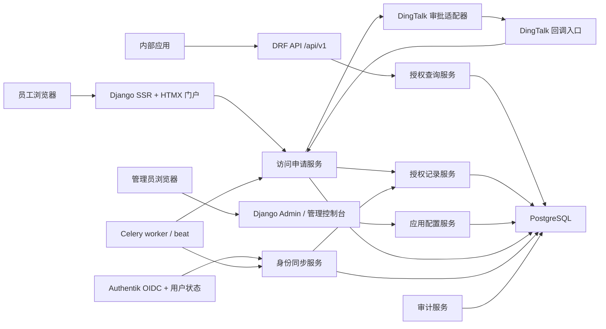
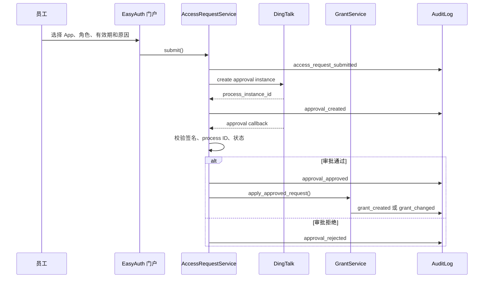

# EasyAuth 架构设计文档

## 状态

当前有效架构设计。本文已整合历史规格、技术规划和 MVP 方案中的有效决策，用于指导 MVP 实现与试点接入。

## 设计目标

EasyAuth 是单公司内部部署的集中式授权层。它不替代 Authentik 的认证和身份生命周期能力，也不替代 DingTalk 的审批流程能力。它的核心职责是让内部应用通过一个稳定 API 查询用户在本应用中的角色和权限，并让员工通过自助门户发起由 DingTalk 支撑的访问申请。

MVP 成功标准是：试点内部应用可以在一个工作日内接入 EasyAuth，之后不再自行实现 DingTalk 审批、角色和权限逻辑。

本设计优先满足以下约束：

- Authentik 是登录身份、用户 UID 和在职状态的权威来源。
- DingTalk 只提供审批流程，不是授权事实来源，也不是在职状态来源。
- EasyAuth 是已连接内部应用的授权事实来源。
- 公共 `user_id` 使用 Authentik UID/OIDC subject，不暴露 EasyAuth 内部数据库 ID。
- 内部应用凭据同时支持静态 app token 与 OAuth2 client credentials，但两者必须得到完全一致的授权查询结果。
- 所有公共接口遵循契约优先、统一错误语义、边界校验和向后兼容扩展。

## 非目标

MVP 不实现多租户 SaaS、完整 IAM 套件、ABAC 策略引擎、行级或字段级数据权限、AI 权限推荐、复杂权限复制、所有权交接或未经审批的访问授权。

## 总体架构

EasyAuth 采用 Django 模块化单体架构。单体部署降低 MVP 的接入与运维复杂度，模块边界保持清晰，方便后续在确有需要时拆分后台任务、集成适配器或 API 层。



运行组件：

- Django web 进程：承载员工门户、管理控制台、DRF API、Authentik 登录回调、DingTalk 回调。
- PostgreSQL 16+：主数据存储，保存领域模型、配置、授权记录和审计日志。
- Redis：Celery broker。
- Celery worker：处理 Authentik 定时同步、DingTalk 审批状态兜底查询、授权过期清理和异步重试。
- Authentik：登录、OIDC subject、用户 active/disabled/departed 状态来源。
- DingTalk：审批实例创建和审批结果回调。

## 建议代码结构

以下结构是实现目标，不代表当前仓库已存在源码：

```text
src/easyauth/
  config/                 # Django settings、URL 路由、ASGI/WSGI
  accounts/               # Authentik 登录、User mirror、用户状态同步入口
  applications/           # App、Role、Permission、ApprovalRule、凭据管理
  access_requests/        # AccessRequest 状态机、员工申请服务
  grants/                 # AccessGrant、权限解析、版本和缓存 TTL
  api/                    # DRF serializers、views、认证类、OpenAPI 契约
  integrations/
    authentik/            # Authentik API client、webhook payload 解析
    dingtalk/             # DingTalk approval gateway、callback payload 解析
  audit/                  # append-only AuditLog 写入与查询
  portal/                 # 员工门户 SSR + HTMX 页面
  admin_console/          # 自定义管理页；早期可主要使用 Django Admin
  tasks/                  # Celery task 定义
tests/
  unit/
  integration/
  e2e/
```

模块依赖方向：

- `api` 和 `portal` 可以调用领域服务，但不能直接绕过领域服务写 `AccessGrant`。
- `integrations` 只负责外部协议、签名校验、payload 解析和 API 调用，不承载授权决策。
- `grants` 是授权记录的唯一写入口。
- `audit` 是所有安全敏感事件的统一写入口。
- `applications` 负责配置和凭据生命周期，不决定单个用户是否获得授权。

## 领域模型设计

### UserMirror

镜像 Authentik 用户。公共接口使用 `authentik_user_id`，内部数据库主键只用于关系和查询优化。

关键字段：

- `id`
- `authentik_user_id`
- `name`
- `email`
- `department`
- `status`: `active`、`disabled`、`departed`
- `dingtalk_union_id`
- `dingtalk_userid`
- `dingtalk_corp_id`
- `employee_number`
- `manager_userid`
- `created_at`
- `updated_at`

设计规则：

- `authentik_user_id` 全局唯一且不可变。
- 邮箱、手机号、工号、DingTalk ID 都不是规范授权标识符。
- Authentik `inactive` 或 `disabled` 会映射为不可保留授权的状态。

### App

连接到 EasyAuth 的内部应用。

关键字段：

- `id`
- `app_key`
- `name`
- `description`
- `status`: `active`、`disabled`
- `cache_ttl_seconds`
- `created_at`
- `updated_at`

设计规则：

- `app_key` 是公共 API 路径标识，必须稳定且唯一。
- `cache_ttl_seconds` 默认 300 秒，最低可配置到 60 秒，最高 900 秒。
- 禁用应用不能查询权限，也不能创建新的访问申请。

### Role、Permission 与 RolePermission

`Role` 是员工主要申请的授权单元，`Permission` 是内部应用消费的细粒度能力。

设计规则：

- `Role.key` 和 `Permission.key` 在同一个 `app_id` 下唯一。
- `Role.requestable=false` 的角色不能出现在员工申请选项中。
- `RolePermission` 必须保证角色和权限属于同一 App。
- 权限 key 使用稳定字符串，例如 `customer:view:department`。

### ApprovalRule

定义角色或权限申请必须由谁审批。

建议存储方式：

- 使用 `app_id`
- 使用 `target_type`: `role` 或 `permission`
- 存储明确的 `role_id` 或 `permission_id`，并通过数据库约束保证二者有且仅有一个。
- 对外展示时仍使用 `target_type` 和 `target_id`。

这样比通用外键更容易加约束，也能减少错误配置。

### AccessRequest

表示员工发起的 grant、change 或 revoke 申请。

关键字段：

- `id`
- `requester_user_id`
- `app_id`
- `request_type`: `grant`、`change`、`revoke`
- `status`
- `requested_roles`
- `requested_permissions`
- `grant_lifetime_type`: `permanent` 或 `timed`
- `grant_expires_at`
- `request_reason`
- `dingtalk_process_instance_id`
- `created_at`
- `updated_at`

状态机：

```text
draft
  -> submitted
  -> approval_pending
  -> approved
  -> grant_applied

approval_pending
  -> rejected
  -> cancelled

approved
  -> grant_failed
```

设计规则：

- `grant_lifetime_type=timed` 时必须填写 `grant_expires_at`。
- `grant_lifetime_type=permanent` 时 `grant_expires_at` 必须为空。
- 拒绝审批永远不能创建或变更授权记录。
- `approved` 不是最终业务完成状态，只有 `grant_applied` 表示授权已经落库。

### AccessGrant

表示某用户在某应用上的当前授权状态。

建议将角色和权限集合拆成子表存储：

- `AccessGrant`
  - `id`
  - `user_id`
  - `app_id`
  - `status`: `active`、`revoked`、`expired`
  - `source_request_id`
  - `version`
  - `grant_lifetime_type`
  - `grant_expires_at`
  - `created_at`
  - `updated_at`
- `AccessGrantRole`
  - `grant_id`
  - `role_id`
- `AccessGrantPermission`
  - `grant_id`
  - `permission_id`

设计规则：

- 每个 `user_id + app_id` 最多存在一个当前授权记录。
- 每次创建、变更、撤销或过期都必须递增 `version`。
- `grant_expires_at` 表示授权记录生命周期，不是 API 响应缓存过期时间。
- 直接权限只用于应用确实需要的细粒度授权，MVP 默认通过角色展开权限。

### AppCredential 与 OAuth client binding

内部应用可以使用两种凭据：

- 静态 app token：hash 存储，只展示一次，可轮换，可禁用，绑定单个 App。
- OAuth2 client credentials：通过 Django OAuth Toolkit 签发短期 access token，client 绑定单个 App。

两种凭据在权限查询中映射为同一种内部调用主体：

```text
AppPrincipal {
  app_id
  app_key
  credential_type
  credential_id
}
```

授权查询服务只能接收 `AppPrincipal`，不能接收原始 token 或 client secret。

### AuditLog

append-only 安全事件日志。

关键字段：

- `id`
- `actor_type`: `user`、`admin`、`app`、`system`、`dingtalk`、`authentik`
- `actor_id`
- `event_type`
- `target_type`
- `target_id`
- `metadata`
- `created_at`

最少事件：

- `access_request_submitted`
- `approval_created`
- `approval_approved`
- `approval_rejected`
- `grant_created`
- `grant_changed`
- `grant_revoked`
- `grant_expired`
- `grant_apply_failed`
- `user_departure_detected`
- `app_permission_queried`
- `app_credential_created`
- `app_credential_rotated`
- `emergency_revoke_applied`

## 公共 API 契约

### 契约原则

- 所有 `/api/v1` 响应字段使用 snake_case，与现有规格保持一致。
- REST 路径使用复数资源名，不在路径中放动词。
- 列表接口必须从一开始支持分页。
- 错误响应必须使用统一结构。
- 新字段只能以可选字段方式添加；不能修改既有字段含义或类型。
- 静态 token 与 OAuth2 access token 只影响认证方式，不能影响授权结果。

### 统一错误格式

```json
{
  "error": {
    "code": "VALIDATION_ERROR",
    "message": "请求参数无效。",
    "details": {
      "field": "reason"
    }
  }
}
```

状态码约定：

| 状态码 | 使用场景 |
| --- | --- |
| 400 | 请求格式或查询参数非法 |
| 401 | 缺失凭据、无效凭据或过期 OAuth2 token |
| 403 | 凭据有效但无权访问该 App，或绑定 App 已禁用 |
| 404 | 请求的管理资源不存在；权限查询不使用 404 表示用户不存在 |
| 409 | 状态转换冲突、重复配置、版本冲突 |
| 422 | 语义校验失败，例如 timed 授权缺少过期时间 |
| 500 | EasyAuth 内部错误，不暴露实现细节 |

### 查询用户权限

```http
GET /api/v1/apps/{app_key}/users/{user_id}/permissions
Authorization: Bearer {app_token_or_oauth_access_token}
```

路径参数：

- `app_key`: 调用方应用 key。
- `user_id`: Authentik UID/OIDC subject。

成功响应：

```json
{
  "user_id": "ak_uid_123",
  "app_key": "crm",
  "roles": ["sales_manager"],
  "permissions": ["customer:view:department", "customer:edit:own"],
  "version": 12,
  "expires_at": "2026-06-05T10:15:00Z"
}
```

无有效权限响应：

```json
{
  "user_id": "ak_uid_123",
  "app_key": "crm",
  "roles": [],
  "permissions": [],
  "version": 13,
  "expires_at": "2026-06-05T10:15:00Z"
}
```

行为规则：

- 凭据必须解析为一个绑定 App 的 `AppPrincipal`。
- 路径中的 `app_key` 必须与 `AppPrincipal.app_key` 完全匹配，否则返回 403。
- 绑定 App 被禁用时返回 403。
- 用户不存在、disabled 或 departed 时返回空 roles 和 permissions，不暴露用户存在性差异。
- 用户不存在且没有历史授权记录时 `version` 返回 0；用户存在但授权已被撤销或过期时返回该用户在该 App 下的最新授权版本。
- 过期、revoked 或 inactive 用户的授权记录不参与权限计算。
- `permissions` 是直接权限与角色展开权限的去重并集，返回顺序按 key 升序稳定排序。
- `roles` 返回当前 active grant 的角色 key，按 key 升序稳定排序。
- `expires_at` 是客户端缓存过期时间，不是授权生命周期。
- 如果最近的 `grant_expires_at` 早于配置 TTL，则 `expires_at` 取最近授权过期时间，避免客户端缓存越过授权生命周期。
- 每次成功查询写入 `app_permission_queried` 审计事件，至少记录 app、user、version、result count 和 credential metadata。

### OAuth2 client credentials

```http
POST /oauth/token
Content-Type: application/x-www-form-urlencoded

grant_type=client_credentials&client_id={client_id}&client_secret={client_secret}
```

该端点由 Django OAuth Toolkit 提供。EasyAuth 需要在 client 创建和 token 校验时保证 OAuth client 精确绑定一个 App。OAuth access token 调用权限查询时，与静态 app token 得到同一 `AppPrincipal` 语义。

### 试点集成包应暴露的 API 文档

试点文档至少包含：

- 静态 token 和 OAuth2 client credentials 两种认证方式。
- Authentik UID 作为 `user_id`。
- 权限查询端点、响应示例、空权限响应示例。
- 错误码、缓存规则、version 语义和撤权 SLA。
- CRM 示例角色和权限 key。

## 内部服务接口

内部模块使用明确服务接口隔离状态变更。以下接口为设计契约，具体实现可以使用 Django service class 或函数模块。

```text
PermissionQueryService.resolve(app_principal, app_key, authentik_user_id) -> PermissionQueryResult
AccessRequestService.submit(requester, app, target_roles, target_permissions, lifetime, reason) -> AccessRequest
DingTalkApprovalGateway.create_instance(access_request) -> DingTalkProcessRef
DingTalkCallbackService.handle(payload, headers) -> CallbackResult
GrantService.apply_approved_request(access_request) -> AccessGrant
GrantService.revoke_for_user(user, reason, actor) -> list[AccessGrant]
AuthentikSyncService.upsert_user(authentik_payload) -> UserMirror
AuditService.record(event) -> AuditLog
```

接口规则：

- 外部输入只能在 API view、form handler、webhook handler 和 integration adapter 边界处校验。
- 校验通过后，内部服务依赖类型化对象，不重复解析原始 dict。
- 所有改变 `AccessRequest`、`AccessGrant`、`AppCredential` 和 `ApprovalRule` 的操作必须通过服务层写审计日志。
- `GrantService` 是唯一可以创建、变更、撤销授权记录的模块。

## 核心流程

### 访问申请流程



幂等规则：

- `dingtalk_process_instance_id` 必须唯一。
- 回调处理必须在数据库事务中锁定对应 `AccessRequest`。
- 重复批准回调只能返回已处理结果，不能再次递增授权版本。
- 重复拒绝回调不能覆盖已经 `grant_applied` 的请求。
- 未知 process instance、签名失败和 payload 结构异常必须记录安全相关日志。

### 权限查询流程

```text
1. DRF 认证类解析 Bearer token。
2. 认证类输出 AppPrincipal。
3. API view 校验 app_key 与 AppPrincipal 绑定 App 是否一致。
4. PermissionQueryService 读取 UserMirror、App、AccessGrant、RolePermission。
5. 服务过滤 disabled/departed 用户、revoked grant、expired timed grant。
6. 服务计算 roles、permissions、version 和 expires_at。
7. API view 返回稳定 JSON 响应并记录审计事件。
```

### 离职清理流程

Authentik 状态通过 webhook 和定时同步两条路径进入 EasyAuth。

- webhook 用于快速响应。
- 定时同步用于最终一致性兜底。

当 Authentik 表示用户 inactive、disabled 或 departed：

1. `AuthentikSyncService` 更新 `UserMirror.status`。
2. `GrantService.revoke_for_user` 撤销该用户所有 active grant。
3. 每条受影响 grant 递增 version。
4. 写入 `user_departure_detected` 与 `grant_revoked` 审计事件。
5. 后续权限查询返回空 roles 和 permissions。

### 授权过期流程

Celery beat 定期扫描 `grant_lifetime_type=timed` 且 `grant_expires_at <= now()` 的 active grant。

处理规则：

- 每条过期 grant 在事务中从 active 转为 expired。
- 递增 version。
- 写入 `grant_expired` 审计事件。
- 如果同一 grant 已被人工撤销或离职清理撤销，过期任务必须幂等跳过。

## 数据一致性与事务边界

需要事务保护的操作：

- 提交访问申请并创建初始审计事件。
- DingTalk 回调状态转换。
- 审批通过后应用授权记录。
- 授权记录变更、撤销、过期和紧急撤权。
- App 凭据创建、轮换和禁用。

授权记录应用的事务顺序：

1. 锁定 `AccessRequest`。
2. 确认请求状态是 `approved` 且尚未 `grant_applied`。
3. 锁定或创建 `AccessGrant(user_id, app_id)`。
4. 替换目标角色和直接权限集合。
5. 应用 grant 生命周期字段。
6. 递增 version。
7. 写入审计事件。
8. 将请求状态更新为 `grant_applied`。

如果第 3 到第 7 步失败，请求状态应进入 `grant_failed`，并写入 `grant_apply_failed`。失败不得静默吞掉。

## 安全设计

### 身份与会话

- 员工登录使用 Authentik OIDC。
- 登录回调只接受已配置 issuer、audience 和 redirect URI 的 token。
- Django session 用于门户和管理控制台。
- 管理端权限由 EasyAuth 管理员角色控制，不能由 DingTalk 审批结果隐式授予。

### 应用认证

- 静态 app token 只以 hash 形式存储。
- token 创建时只展示一次明文。
- token 轮换支持新旧 token 短暂并存，禁用旧 token 后立即不可用。
- OAuth2 client secret 不记录明文。
- 每个 token 或 OAuth client 只能绑定一个 App。
- 权限查询必须校验路径 `app_key` 与凭据绑定 App 一致。

### 外部输入

需要作为不可信输入校验：

- DingTalk callback headers 和 body。
- Authentik webhook payload。
- Authentik 定时同步 API 响应。
- DingTalk profile 或 approval API 响应。
- 员工门户表单提交。
- 管理端配置表单。
- 内部应用 API 请求。

校验策略：

- 在边界使用 DRF serializers、Django forms 或明确 schema 解析。
- 校验失败返回统一错误结构或记录 webhook 安全事件。
- 外部响应字段不能直接进入授权决策，必须先转换为内部类型化对象。

### 审批与授权边界

- DingTalk 批准只表示流程通过，不直接授予权限。
- EasyAuth 在 `GrantService` 中根据已批准的 `AccessRequest` 应用授权。
- 紧急撤权只能减少访问权限，不能授予或增加权限。
- 没有审批规则的 role 或 permission 不能被员工申请。

## 缓存、版本与撤权 SLA

权限查询响应中的 `version` 是单调递增的授权记录版本，用于内部应用识别本地缓存是否过时。响应中的 `expires_at` 是缓存有效期，不是授权记录有效期。

缓存计算：

```text
configured_expiry = now + app.cache_ttl_seconds
grant_expiry = nearest active timed grant_expires_at for this user/app
expires_at = min(configured_expiry, grant_expiry) if grant_expiry exists
expires_at = configured_expiry otherwise
```

默认策略：

- 默认 TTL：300 秒。
- 最大 TTL：900 秒。
- 高风险应用最低 TTL：60 秒。
- 默认撤权 SLA：已连接应用应在 5 分钟内停止使用已撤销权限。

内部应用接入文档必须要求客户端只缓存到 `expires_at`，不能自行延长缓存。

## 可观测性与审计

审计日志记录事实，不记录推测。每条安全敏感事件至少包含：

- actor 类型与 ID。
- target 类型与 ID。
- event type。
- request ID、grant ID、app key、authentik user ID 等关键上下文。
- old version 与 new version。
- 外部 process instance ID 或 credential ID。
- 创建时间。

普通应用日志用于排障，不能替代审计日志。审计查询应支持按 user、app、request、grant、event_type 和时间范围过滤，并且分页。

## 管理控制台边界

MVP 早期可以优先使用 Django Admin 完成试点配置，但需要保证：

- 安全敏感字段只读或受控展示。
- app token 明文不在列表页、详情页或日志中出现。
- 审计日志不可编辑、不可删除。
- ApprovalRule 配置保存时校验目标角色或权限属于同一 App。
- 没有审批规则的 requestable role 不能被员工申请。

后续自定义管理控制台应复用 `applications`、`grants` 和 `audit` 服务，不重新实现授权写入逻辑。

## 测试策略

最低测试层级：

- 单元测试：AccessRequest 状态机、GrantService 版本递增、缓存过期计算、ApprovalRule 校验。
- 集成测试：权限查询 API、静态 token 认证、OAuth2 client credentials、跨应用拒绝、DingTalk callback 幂等、Authentik webhook 与定时同步。
- 端到端 smoke：Authentik 登录、申请 CRM role、DingTalk mock 审批、授权记录应用、CRM 权限查询。
- 管理端 smoke：从空库创建 CRM App、roles、permissions、role mappings、approval rules、app credentials。

质量门槛：

- `python manage.py check`
- `python manage.py migrate --check`
- `pytest`
- `ruff`
- `basedpyright`
- Playwright smoke

当前仓库还没有实现代码，上述门槛应在 Django 项目初始化后加入标准命令文档。

## 关键取舍

### 采用模块化 Django 单体

选择原因：

- MVP 需要快速完成内部试点接入。
- Django Admin 能加速应用、角色、权限和审批规则配置。
- 单体事务边界清晰，适合审批回调、授权记录和审计日志的一致性要求。

放弃方案：

- 前后端完全分离：会增加认证、CSRF、部署和权限页面实现成本。
- 微服务拆分：当前业务边界尚未证明需要独立部署，过早拆分会增加事务和审计复杂度。

### 授权查询 API 优先

选择原因：

- MVP 成功标准依赖内部应用一天内接入。
- API 契约一旦被内部应用使用，就会成为事实契约。
- 先稳定查询契约可以避免 UI 和审批流程实现后再反复修改授权输出。

### 一个 API 版本内向后兼容扩展

选择原因：

- 静态 token 与 OAuth2 client credentials 不应形成两套接口。
- 内部应用接入成本应该低，不能要求不同应用选择不同版本。
- 新字段通过可选字段添加，避免破坏已连接应用。

## 后续实现顺序

建议实现顺序：

1. 初始化 Django 项目、PostgreSQL 设置、测试与质量命令。
2. 建立核心模型、数据库约束和审计写入。
3. 优先实现权限查询 API 与两类应用凭据认证。
4. 接入 Authentik 登录和用户状态同步。
5. 通过 Django Admin 配置 CRM 试点应用。
6. 实现员工申请流程。
7. 集成 DingTalk 审批创建与回调。
8. 应用授权记录并完成端到端 CRM 权限查询。
9. 实现紧急撤权、授权过期清理和试点集成包。

## 开放输入

以下不是架构阻塞项，但在试点部署前必须确定：

- Authentik issuer URL、client ID、client secret 和 callback URL。
- DingTalk app key/client ID、secret、agent ID 和 approval process code。
- CRM app owner、首个审批路由规则和角色审批人。
- 生产域名、HTTPS 证书和网络访问策略。
- 审计日志保留周期与导出要求。
