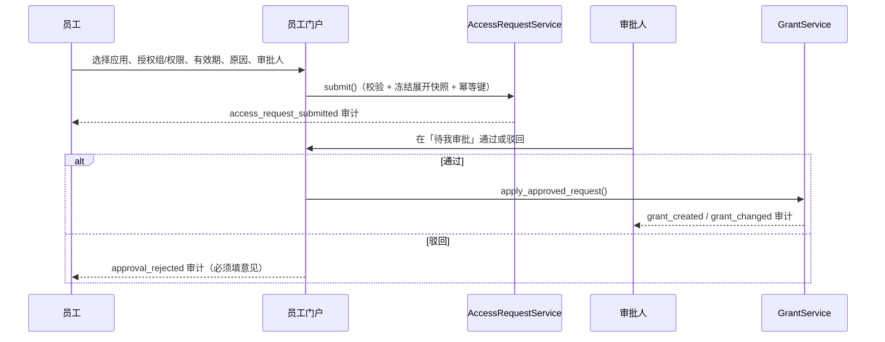

# EasyAuth 架构设计

本文描述 EasyAuth 的**当前**架构：模块边界、领域模型、核心流程和安全设计。接口细节以
[`docs/api/`](../api/) 下的三份 API 文档为准，本文不重复字段级契约。

## 1. 定位

EasyAuth 是单公司内部部署的集中式**授权**层。它不替代 Authentik 的认证与身份生命周期，也不
替代钉钉的审批流程；它回答的是一个问题：

> 这个用户此刻在**这个应用**里有哪些权限？

三方分工：

| 系统 | 权威范围 |
| --- | --- |
| Authentik | 登录身份、公共 `user_id`（OIDC subject）、在职状态、组织目录来源 |
| 钉钉 | 组织通讯录、下游应用发起的审批流程、工作通知投递 |
| **EasyAuth** | **授权事实**——谁在哪个应用有什么权限 |

不做的事：多租户 SaaS、完整 IAM 套件、ABAC 策略引擎、行级/字段级数据权限、未经审批的授权。

## 2. 运行形态

Django 模块化单体。单体让审批、授权落库和审计共享一个事务边界，模块边界保持清晰以便将来
按需拆分。

| 组件 | 职责 |
| --- | --- |
| Django web（gunicorn） | 员工门户、管理控制台、公共 API、OIDC 回调 |
| PostgreSQL | 领域模型、配置、授权事实、审计日志 |
| Redis | Celery broker/result、缓存、限流计数 |
| Celery worker | 目录同步、授权过期、连接器对账、Webhook 与通知投递、离职处置 |
| Celery beat | 定时调度（见 §7） |
| `run_dingtalk_stream` | 钉钉 Stream 长连接进程，单实例运行 |

前端是 React 19 + Vite 单页应用，构建产物落到 `src/easyauth/static/easyauth/frontend`，
由 Django 返回 React shell 承载。

### 模块边界

```text
src/easyauth/
  config/          # settings、URL、WSGI/ASGI、Celery、中间件、限流、加密
  accounts/        # Authentik 登录、本地管理员、UserMirror、钉钉目录镜像
  applications/    # App、Permission、AuthorizationGroup、审批规则、凭据、平台能力
  access_requests/ # AccessRequest 状态机、站内审批、授权落地
  grants/          # AccessGrant —— 授权事实的唯一写入口、权限解析
  api/             # 公共 API /api/v1（权限查询、manifest、审批、目录、通知）
  admin_console/   # 控制台私有 API /console/api/v1
  portal/          # 员工门户私有 API /portal/api/v1
  integrations/    # authentik/ + dingtalk/ 协议适配（签名、payload、Stream）
  connectors/      # 出站供给连接器（NetBird 等）与对账
  lifecycle/       # 离职/转岗交接单、入职岗位模板
  teams/           # 团队与成员
  workflows/       # 审批模板与审批实例（下游应用使用的钉钉审批能力）
  notify/          # 钉钉工作通知消息与收件人
  webhooks/        # 应用 Webhook 配置与投递
  outbox/          # 事务发件箱
  audit/ · tasks/  # append-only 审计 · Celery 任务定义
```

依赖方向的硬规则：

- `grants` 是授权事实的**唯一**写入口，任何模块都不得绕过它写 `AccessGrant`。
- `integrations` 只做协议、签名、payload 解析和外部 API 调用，**不承载授权决策**。
- `audit` 是所有安全敏感事件的统一写入口。
- `applications` 管配置与凭据生命周期，不决定单个用户是否获得授权。
- `admin_console` / `portal` / `api` 可以编排领域服务，但不能直接写授权事实。

## 3. 领域模型

### 身份

**`UserMirror`** 镜像 Authentik 用户，公共标识是 `authentik_user_id`（全局唯一、不可变），
内部主键只用于关系与查询优化。状态为 `active` / `disabled` / `departed`；后两者不保留授权。
邮箱、手机号、工号、钉钉 ID **都不是**规范授权标识符。

钉钉侧另有 `DingTalkUserMirror` / `DingTalkDepartmentMirror` / `DingTalkUserOrgContext`
承载目录镜像与组织关系，按 `(source_slug, corp_id)` 作用域隔离多企业。

`LocalAdminAccount` / `LocalAdminPasskey` 是不依赖 Authentik 的应急登录通道，
见[本地超级管理员登录](../guides/local-admin-login.md)。

### 应用与权限目录

| 模型 | 说明 |
| --- | --- |
| `App` | 已接入应用，由稳定的 `app_key` 标识；`catalog_version` 随目录变更递增 |
| `Permission` | 应用消费的细粒度能力，key 稳定（如 `customer:view:department`）；同一 App 下唯一 |
| `AppScope` | 该应用支持的授权范围（`SELF` / `MANAGED` / `MANAGED_USERS` / `ALL` 等） |
| `AuthorizationGroup` | **员工申请的单元**；`kind` 为 `role` 或 `bundle`；`requestable=false` 不出现在申请选项中 |
| `AuthorizationGroupGrant` | 授权组展开出的 `(permission, scope_key)` 条目 |
| `ManagedScopePolicy` | `MANAGED_USERS` 的解析策略（第一版：钉钉主管链） |
| `ApprovalRule` | 某个授权组或权限由谁审批；数据库约束保证目标二选一 |
| `AppCredential` | 静态 token（hash 存储）与 OAuth2 client，各自绑定唯一 App |
| `AppCapability` | 应用级平台能力开关（`directory` / `notify`） |

权限目录只负责组织和展示，**不产生授权事实**。模板导入不能删除已被引用的 Permission
（只能停用），也不能改变既有 key 的业务含义——含义变了就新增 key 并废弃旧 key。

### 申请与授权

**`AccessRequest`** 表示员工发起的 `grant` / `change` / `revoke` / `renew` 申请。

状态：`submitted` → `approved` → `grant_applied`；分支终态 `rejected`、`withdrawn`、
`grant_failed`、`grant_conflict`、`grant_expired`。

- `approved` **不是**业务完成状态，只有 `grant_applied` 表示授权已落库。
- `grant` 申请的 `base_grant` / `base_grant_revision` 为空；`change` / `revoke` / `renew`
  **必须**绑定提交时的授权主键与 `AccessGrant.version`。
- `grant_type=timed` 必须填 `grant_expires_at`，`permanent` 必须为空（数据库约束）。
- 提交时冻结一份**不可变**的授权组展开快照（`AccessRequestGroupGrantSnapshot`），审批列
  表、审批详情、审计元数据和落地前置校验都读这份快照。提交后的授权组配置变更只影响新申
  请，不改变已提交申请的展示或执行事实。

**`AccessGrant`** 是某用户在某应用的当前授权：

- `(user, app)` 在 `is_current=True` 下唯一——一个用户在一个应用只有一条当前授权。
- `(user, app, version)` 唯一：`version` 是授权事实的锚点，每次创建、变更、撤销、过期都
  递增，并发操作不允许产生两行相同版本号。
- 成员由 `AccessGrantGroup`（授权组）和 `AccessGrantPermission`（直接权限 + scope）组成，
  **有效期落在成员级** `expires_at`，不是父级字段。

### 审计

**`AuditLog`** 是 append-only 的安全事件日志，字段包括 `actor_type`
（`user` / `admin` / `local_admin` / `app` / `system` / `dingtalk` / `authentik`）、`actor_id`、
`event_type`、`target_type` / `target_id`、`metadata`、`created_at`。

记录事实，不记录推测；不可编辑、不可删除。普通应用日志用于排障，不能替代审计日志。
`DirectoryAuditBucket` 用于把高频目录查询按小时聚合，避免审计表被选人器击穿。

## 4. 核心流程

### 4.1 员工申请与站内审批

**审批发生在 EasyAuth 内部**（不是钉钉）。审批人在门户"待我审批"处理，控制台管理员可代审
并留痕（`decision_actor_type = console_admin`）。


```mermaid
sequenceDiagram
  participant E as 员工
  participant P as 员工门户
  participant R as AccessRequestService
  participant A as 审批人
  participant G as GrantService
  E->>P: 选择应用、授权组/权限、有效期、原因、审批人
  P->>R: submit()（校验 + 冻结展开快照 + 幂等键）
  R-->>E: access_request_submitted 审计
  A->>P: 在「待我审批」通过或驳回
  alt 通过
    P->>G: apply_approved_request()
    G-->>A: grant_created / grant_changed 审计
  else 驳回
    P-->>E: approval_rejected 审计（必须填意见）
  end
```

规则：

- 申请人不能审批自己的申请。
- 目标含 `MANAGED_USERS` 范围时，审批人必须是本人的在职直属主管。
- 已有当前授权时不能再提交 `grant`，必须走 `change`——否则审批通过后才会撞唯一约束，白白
  消耗一次审批。
- 幂等键 + payload 摘要防重复提交；`change` / `revoke` / `renew` 的基础授权主键与修订进入
  摘要。

### 4.2 授权落地的事务顺序

1. 锁定 `AccessRequest`，确认状态是 `approved` 且尚未 `grant_applied`。
2. `grant` 申请创建新的当前 `AccessGrant`；生命周期申请锁定冻结的 `base_grant_id`。
3. 比较 `base_grant_revision` 与当前 `AccessGrant.version`：不一致进入 `grant_conflict`，
   接口返回 `409` 要求重新提交。**该状态不进重试通道，也不允许读最新授权重试。**
4. 用提交时冻结的展开快照校验前置事实（已过期成员不属于当前有效成员集合）。
5. 替换、续期或撤销冻结的目标集合，递增 `version`，写审计，状态改为 `grant_applied`。

普通落库失败 → `grant_failed` + `grant_apply_failed` 审计；修订冲突 → `grant_conflict` +
`grant_apply_conflict`；落地前过期 → `grant_expired`。**这些失败都不得静默吞掉。**

### 4.3 权限查询

```text
1. 认证类解析 Bearer token（静态 token 或 OAuth2 access token）→ AppPrincipal
2. 校验路径 app_key == AppPrincipal.app_key，否则 403
3. resolve_user_permissions() 读 UserMirror、App、AccessGrant 及展开的权限
4. 过滤 disabled/departed 用户、revoked/expired 授权、过期成员
5. 解析 MANAGED_USERS（目录故障时显式 503，不返回空集）
6. 返回快照并写 app_permission_queried 审计
```

两种凭据得到**完全一致**的授权结果——凭据只影响认证方式，不影响授权结果。

### 4.4 离职与目录同步

Authentik 的组织事实通过 `dingtalk-directory-sync`（默认 300 秒）回灌 `UserMirror`；钉钉
Stream 事件用于把延迟从"轮询间隔之和"压到秒级，beat 轮询作为断连兜底。详见
[钉钉 Stream 事件集成](easyauth-dingtalk-stream-design.md)。

检出离职后：更新 `UserMirror.status` → 撤销全部当前授权（逐条递增 version）→ 建交接单 →
禁用 Authentik 账号并吊销会话 → 写 `user_departure_detected` / `grant_revoked` 审计。
后续权限查询返回空结果。

从未登录过系统的员工没有 `UserMirror`，只会从目录镜像和他人管理范围中消失——无账号可禁、
无授权可撤。

### 4.5 授权过期

beat 每 60 秒扫描到期的成员级 `expires_at`，在事务中转为过期、递增 version、写
`grant_expired` 审计。已被人工撤销或离职清理处理过的授权，过期任务必须幂等跳过。
PostgreSQL 下使用 `select_for_update(skip_locked=True)` 分批处理，避免多 worker 抢同一批。

## 5. 缓存与撤权 SLA

权限查询响应里：

- `grant_version` / `catalog_version` / `snapshot_version` 用于下游判断本地缓存是否过时。
- `expires_at` 是**缓存**有效期，不是授权有效期。

```text
expires_at = min(now + TTL, 最近的成员级 expires_at)
```

TTL 默认 300 秒（`EASYAUTH_PERMISSION_QUERY_CACHE_TTL_SECONDS`）。下游只能缓存到
`expires_at`，不得自行延长。默认撤权 SLA：已接入应用应在 5 分钟内停止使用已撤销的权限。

## 6. 安全设计

### 身份与会话

- 员工登录走 Authentik OIDC；回调只接受已配置 issuer、audience 和 redirect URI 的 token，
  且只绑定 active 的 `UserMirror`。
- **控制台超管权限在每次请求期判定**：通过 Authentik admin API 读取该用户当前组，与
  `EASYAUTH_CONSOLE_SUPERUSER_GROUPS` 求交集。取不到上游当前组时失败关闭，不信任登录时的
  `groups` claim 或 session 快照。
- 本地超级管理员必须绑定至少一种二次因子（TOTP 或通行密钥）才能形成控制台 actor；会话敏感
  操作推进 `session_version`，旧会话立即失效。
- Django Admin **不作为产品特权入口**，生产 URL 不暴露 `/admin/`。

### 应用认证

- 静态 token 只存 hash，明文只展示一次，可轮换可禁用。
- OAuth2 client secret 不记录明文。
- 一条凭据只绑定一个 App；路径 `app_key` 必须与凭据所属应用一致。
- `directory` / `notify` 需要 App 层开通与单凭据授权**同时**通过，见
  [企业目录与钉钉通知](platform-directory-notify.md)。

### 外部输入

以下一律视为不可信输入，在边界处用 serializer / form / 明确 schema 解析后才能影响授权决策：
钉钉回调与 Stream 事件、Authentik 同步响应、下游应用 API 请求、门户与控制台表单、下游描述符
端点响应。外部响应字段不能直接进入授权决策，必须先转成内部类型化对象。

### 审批与授权边界

- 审批通过只表示流程通过，授权由 `GrantService` 落库。
- 紧急撤权只能**减少**访问，不能授予或增加权限。
- 没有审批规则的授权组或权限不能被员工申请。

失败与完成语义的统一口径见[异步动作与失败语义](async-and-failure-semantics.md)。

## 7. 后台调度

| 任务 | 默认周期 | 作用 |
| --- | ---: | --- |
| `easyauth.outbox.dispatch_pending` | 5s | 事务发件箱扫描，恢复发布失败与租约超时的安全关键任务 |
| `easyauth.health.runtime_heartbeat` | 20s | 运行心跳 |
| `easyauth.webhooks.recover_expired_leases` | 15s | Webhook 投递租约 watchdog |
| `easyauth.grants.cleanup_expired_grants` | 60s | 授权过期清理 |
| `easyauth.connectors.schedule_reconciles` | 60s | 连接器对账调度 |
| `easyauth.notify.reconcile_send_results` | 60s | 通知回执对账 |
| `easyauth.authentik.sync_dingtalk_directory` | 300s | 钉钉目录同步兼离职回收 |
| `easyauth.health.run_dependency_health_checks` | 300s | 上游依赖健康探测 |
| `easyauth.health.data_retention_cleanup` | 1d | 数据保留矩阵清理 |
| `easyauth.notify.prune_messages` | 1d | 通知历史清理 |
| `easyauth.connectors.prune_sync_runs` | 1d | 连接器运行记录清理 |

全部周期都可用环境变量覆盖。保留矩阵见[数据保留与自动清理](../operations/data-retention.md)。

## 8. 演进约束

- 公共权限查询 API 是下游的稳定契约：只能以可选字段扩展，不得修改既有字段的含义或类型。
- 任何阶段都不能让 Authentik、钉钉或权限模板成为授权事实来源。
- 任何阶段都不能绕过 `GrantService` 写入授权事实。
- 静态 token 与 OAuth2 client credentials 不形成两套接口。
