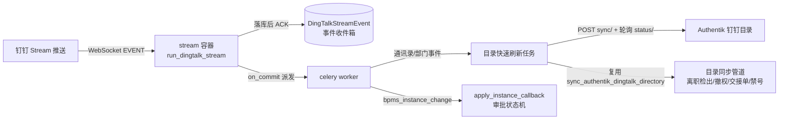

# EasyAuth 钉钉 Stream 事件集成设计

## 背景与目标

钉钉开放平台提供 Stream 模式推送(出站 WebSocket 长连接), 应用无需暴露公网回调地址即可实时接收事件。本设计把 Stream 事件接入 EasyAuth, 解决两件事:

1. **人员入离职等通讯录变更的实时感知。** 原链路完全依赖轮询: Authentik 定时从钉钉拉目录, EasyAuth 再每 5 分钟从 Authentik 拉镜像并检出离职(撤权、建交接单、Authentik 禁号)。事件驱动后, 从员工离职到全链路处置的延迟由"分钟级轮询间隔之和"压缩到秒级。
2. **审批结果的实时推进。** 审批实例事件(`bpms_instance_change`)直接推进 `ApprovalInstance` 状态机, 不再只依赖回调端点或轮询查询。

## 总体链路

关键决策:

- **Stream 消费落在 EasyAuth, 不落在 Authentik。** EasyAuth 已持有钉钉应用凭证(`IntegrationSettings`)、Celery 基础设施、审计与全部离职自动化; Authentik 是上游 fork, 只需要被"催一次同步"(它已有 `POST /api/v3/sources/oauth/dingtalk-directory/{slug}/sync/` 管理端点)。
- **事件不直接改业务事实, 只加速既有管道。** 通讯录事件不做任何"按事件体单点修数据"的捷径, 统一收敛为"触发 Authentik 拉取最新目录 → 等待完成 → 跑 EasyAuth 既有目录同步管道"。离职检出、撤权、交接单、禁号的全部业务规则(含完整性护栏、防误撤)只有一份实现。
- **beat 的 5 分钟 `dingtalk-directory-sync` 保留不动**, 作为 Stream 断连/事件丢失时的兜底信号源。

## 事件收件箱与 ACK 语义

`easyauth.integrations.models.DingTalkStreamEvent`(表 `integrations_dingtalkstreamevent`):

| 字段 | 说明 |
| --- | --- |
| `event_id` | 钉钉事件唯一标识, 唯一约束, 幂等键 |
| `event_type` | 如 `user_leave_org`、`bpms_instance_change` |
| `corp_id` / `born_at` / `data` | 事件头企业标识、产生时间与完整事件体 |
| `status` | `received` → `processed` / `skipped` / `failed` |
| `result` / `error` / `processed_at` | 处理结果线索、失败原因、处理时间 |

ACK 契约(`EasyAuthDingTalkEventHandler`):

- **先落库, 落库成功才 ACK `STATUS_OK`。** 钉钉按 ACK 结果决定是否重投; 持久化失败返回 `STATUS_SYSTEM_EXCEPTION`, 事件由钉钉稍后重投, 不会丢失。
- **重投幂等**: `event_id` 撞唯一约束时直接 ACK(标记 duplicate), 不产生第二次处理。
- 处理本身不在 WebSocket 回调里做: 落库事务提交后经 `current_app.send_task` 派发 `easyauth.dingtalk_stream.process_event`, 由 worker 异步处理, Stream 连接始终保持低延迟 ACK。

## 事件路由

`easyauth.tasks.dingtalk_stream.dispatch_stream_event`:

- **通讯录/部门事件**(`user_add_org`、`user_modify_org`、`user_leave_org`、`user_active_org`、`org_dept_create/modify/remove`) → 防抖合并后触发目录快速刷新(见下节), 事件行记录 `corp_id`、涉及的 `user_ids`、是否真正排队了刷新。
- **审批事件**(`bpms_instance_change`) → 按 `(type, result)` 映射推进审批状态机: `finish+agree→approved`、`finish+refuse→rejected`、`terminate→canceled`; `start` 只记录(实例是 EasyAuth 自己发起的, 提交状态已落库)。不属于 EasyAuth 的实例(企业内其他流程)标记 `skipped`, 终态冲突按契约错误落 `failed` 并抛出。
- **其余事件类型** → `skipped` 保留在收件箱。这是后续扩展(智能人事入离职档案、考勤等)的观测依据: 先在收件箱看到真实事件体, 再决定接入方式, 不预先猜测事件契约。

### 一线员工口径

不是每个入离职员工都使用这些系统。该口径由既有账号模型天然保证, 事件接入不改变它:

- **入职不建账号**: Authentik 账号只在员工首次钉钉 OAuth 登录时创建(enrollment), `user_add_org` 只会把新员工带进目录镜像与主管链(`MANAGED_USERS` 解析), 不产生任何授权事实。
- **离职分两种**: 用过系统的员工(存在 `UserMirror`)走完整处置——撤销 current 授权、建交接单、Authentik 禁号+吊销会话; 从未登录过的一线员工只是从目录镜像消失、从他人管理范围中移除, 无账号可禁、无授权可撤。

## 目录快速刷新

`easyauth.integrations.authentik.directory_refresh.refresh_dingtalk_directory`:

1. 读取 Authentik 该 corp 当前 `finished_at` 作为基线(用上游自己的时间戳判断完成, 避免两台主机时钟偏差);
2. `AuthentikDirectoryClient.trigger_sync(corp_id)` 触发 Authentik 从钉钉拉目录(响应必须确认 `queued`);
3. 轮询 `status/` 直到该 corp 出现新的终态: `success` 继续、`error` 显式失败、超时(默认 180 秒)按目录不可用失败——三者都会走 Celery 重试(指数退避), 且始终有 beat 轮询兜底;
4. 复用 `sync_authentik_dingtalk_directory` 跑完整镜像同步与离职处置。

**防抖合并**: 组织调整常带来事件风暴(一次转移部门可能触发几十条事件)。`request_directory_refresh` 用缓存标记合并——窗口内(5 秒)多条事件只排一次刷新任务; 刷新任务开始执行时先清除标记, 之后到达的事件会重新排队, 保证任何事件都被其后的一次完整同步覆盖, 不存在"事件夹在两次同步之间被错过"的窗口。标记带 10 分钟 TTL, 防止任务丢失后卡死。

## 进程与部署

- 新增常驻进程: `python manage.py run_dingtalk_stream`(`docker-compose.deploy.yml` 的 `stream` 服务, 与 web/worker/beat 共用镜像与 redis)。凭证未配置时进程快速失败退出, 由容器 restart 拉起重试。
- SDK: [`dingtalk-stream`](https://github.com/open-dingtalk/dingtalk-stream-sdk-python)(`pyproject.toml` 运行时依赖), `start_forever()` 自带断线重连。
- 单实例运行, 不要 scale: 多实例会收到重复推送, 虽有 `event_id` 幂等兜底, 但没有收益。

### 钉钉开放平台配置(一次性)

1. 开发者后台 → 应用 → 开发配置 → **事件订阅**: 推送方式选择 **Stream 模式**(替代 HTTP 回调, 无需公网地址与加解密配置)。
2. 订阅通讯录事件(员工与部门变更)。应用需具备**通讯录只读权限**(与既有目录同步共用同一钉钉应用即可)。
3. 如需审批事件, 为对应审批模板订阅 **OA 审批事件**(`bpms_instance_change`)。
4. 应用凭证复用 EasyAuth 控制台"集成设置"里的 `dingtalk_app_key/app_secret`(数据库优先, 环境变量兜底), 无新增配置项。

### 运维观测

- 收件箱可在 Django admin(`DingTalkStreamEvent`, 只读)按状态/类型筛查; `failed` 行携带完整错误与原始事件体, 修复后可人工重放(把 `status` 改回 `received` 后重新派发任务)——正常路径不允许人工改写。
- 目录刷新的结果落在既有 `DingTalkDirectorySyncState` 与任务日志; 离职处置照旧产生审计事件与交接单。
- Stream 进程掉线的影响面 = 退化回既有轮询节奏(最长 5 分钟 + Authentik 自身同步间隔), 不丢业务事实。

## 测试

- `tests/integration/integrations/test_dingtalk_stream.py`: 落库幂等与派发、ACK/NACK 契约、目录事件防抖合并、缺 corp_id 契约失败、审批事件四种流转、未处理类型保留、重放无副作用、凭证缺失快速失败。
- `tests/integration/authentik/test_directory_refresh.py`: 触发-等待-同步全链路、上游同步失败显式报错、running 卡死超时报错。
