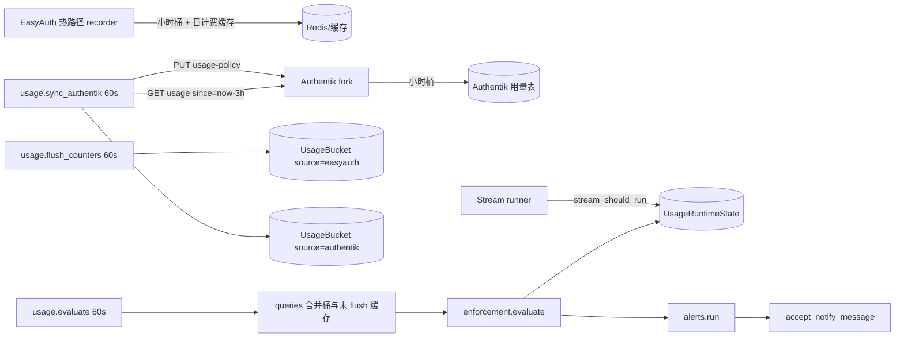

# 用量监控

EasyAuth 是钉钉用量的唯一决策中枢: 本仓库与 Authentik fork 各自按小时桶计数, EasyAuth
每分钟拉取 Authentik 桶、合并未 flush 的缓存计数, 计算配额/策略/告警, 再把执法决定
推回 Authentik。控制台「状态健康」页的「用量监控」页签展示结果。

## 计量指标

| 指标 | 含义 | 配额口径 |
| --- | --- | --- |
| `api` | 出站钉钉 REST | 只约束 **计费** 调用; 展示为 合计 / 计费 / 不计费 |
| `webhook` | 入站钉钉 HTTP 回调(当前仅 `POST /integrations/dingtalk/callback`) | 计费, 仅告警 |
| `stream` | 入站钉钉 Stream 事件 | 计费, 可选暂停连接 |
| `internal` | EasyAuth → Authentik / NetBird / 业务 webhook 与 hook | 计入「不计费」展示, **永不配额** |

两条来源: `easyauth`(本仓库热路径) 与 `authentik`(fork 的目录拉取与登录调用)。Authentik
自管小时桶; EasyAuth 每分钟拉取后是配额、策略、告警的唯一大脑。

默认配额(自然月与本地日, `settings.TIME_ZONE`, 现网 `Asia/Shanghai`):

- api: 月 500000 / 日 5000
- webhook: 月 50000 / 无日上限
- stream: 均未设置

## 出站优先级

仅对计费的钉钉出站调用生效。不计费调用(如 `token` 探活)永远放行。

| 优先级 | 典型类别 |
| --- | --- |
| P0 | 登录、token、审批创建 |
| P1 | 工作通知发送、机器人发送、事件触发的增量目录同步 |
| P2 | 回执对账轮询、定时全量目录同步、连通性探测、管理员白名单遍历 |

## 超限策略

「超限」= 日上限触达 **或** 月配额 ≥ 100%。

### api

- `alert_only`: 只告警, 不拦截。
- `degrade`(默认): 超限拦截 P2; 月用量 ≥ `degrade_escalation_percent`(默认 120) 时再拦截 P1; P0 始终放行。
- `throttle`: 超限后 P1/P2 各限制为每小时 N 次(`throttle_per_hour`), P0 不限。
- `block_all`: 超限后拒绝全部计费调用(含 P0)。不计费永不拒绝。

### webhook

只允许 `alert_only`。

### stream

- `alert_only`(默认): 只告警。
- `pause_stream`: 超限后关闭 Stream, 直到下一个配额周期开始, 或管理员点「恢复」。同一周期内手动恢复后不再自动暂停。

## 执法热路径

`enforcement.decide(category)` 只读缓存(缺缓存或非法 → 放行)。除分钟评估器写入的状态外,
api 还用缓存中的当日计费计数做实时日上限:

- `usage:day:{YYYYMMDD 本地}:api_billed`(recorder 对计费类别递增)
- `usage:day:{YYYYMMDD}:api_billed_authentik`(上次从 Authentik 拉取的计费份额)

两值之和 ≥ 日上限时, 按当前 `over_limit_policy` 立即按「超限」处理, 避免一分钟内打穿。
当日计数缓存缺失 → 放行。节流计数键为 `usage:throttle:{UTC 小时}:{priority}`, 递增失败则放行。

`stream_should_run()` 读执法缓存, 未命中则回退 `UsageRuntimeState`。`resume_stream(actor)`
清除暂停标志并记下当前周期, 评估器在同一周期内不再自动暂停。

推给 Authentik 的策略体(`authentik_policy(state)`):

```json
{
  "blocked_priorities": ["p2"],
  "throttle_per_hour": {"p1": null, "p2": 20},
  "block_p0_billed": false,
  "expires_at": "<ISO UTC, now+10min>"
}
```

`ak_token`(不计费)在 fork 侧永不拒绝; P0 计费仅当 `block_p0_billed=true`(对应 `block_all`)。

## 告警规则

告警 **只** 由每分钟任务 `easyauth.usage.evaluate` 产生, 热路径 `decide()` 不发告警。

- **阈值**: 每个指标对日上限、月配额分别用 `alert_thresholds_percent`(默认 50/80/100)。
  同一评估里同一 metric+scope 只投递新越过的最高档, 较低档落库为 `superseded`。
- **用量异常**: 当前本地时钟小时至今的计数 > `hourly_absolute`(若设置) **或** >
  `baseline_multiplier`(默认 5) × 过去 7 天同一时钟小时的完整小时均值, 且 ≥
  `baseline_min_calls`(默认 200)。不按已过分钟放大或缩小。每指标冷却
  `cooldown_minutes`(默认 60)。摘要字段 `last_hour` 使用同一口径(`queries.current_hour`)。
- **策略变更**: api 进入非 `normal` 时写 `enforcement`, 每个 (metric, period) 最多一次。
- **Stream**: 暂停/恢复写 `stream_paused` / `stream_resumed`。

一次评估合并成 **一条** 钉钉消息, 标题「EasyAuth 用量告警」, 正文列出每条告警(指标、范围、
已用/上限、百分比、策略效果)以及该批事件最早的 `created_at`(本地时间)。`dedup_key` 只由排序后的
告警身份(`kind`、`metric`、`scope`、`period_key`、`threshold_percent`)哈希决定, **不含分钟**,
因此同一批告警重试时正文与键都不变, 通知管道按幂等键命中已受理消息, 不会再写第二条钉钉消息。
收件人为 `UserMirror.is_console_admin=True` 且能解析到钉钉 userid 的用户; 发送方为
`alerts.sender_app_key`(默认 `host-ops`), 走既有 `accept_notify_message` 管道(活动凭据 +
活动通知通道)。身份/通道未就绪或收件人为 0 时, 事件状态 `failed`, 中文 `failure_reason`;
`alerts.sender_status()` 供控制台摘要。

## 防风暴保证

1. 只有评估器产生告警, 热路径不发。
2. 唯一约束 `(kind, metric, scope, period_key, threshold_percent)` 去重; `IntegrityError` 视为已告警。
3. 同一次评估同一 metric+scope 只发送最高新越档, 低档 `superseded`。
4. 异常告警每指标冷却。
5. 全局日上限 `alerts.daily_cap`(默认 30)按当天实际交给 `accept_notify_message` 的合并消息计,
   不按事件行。同一批告警身份在同一本地日只占 1 次, 记在 `UsageAlertSendBatch`;
   重试同一批不重复扣减。发送方未就绪、尚未调用受理的尝试不计入。超出上限的新事件写入
   `suppressed`, 只在页面可见。
6. 策略变更每个 (metric, period) 至多一次。
7. `alerts.enabled=false` 时不发送, 事件仍落库为 `suppressed`。
8. `failed` 事件最多投递 3 次(`delivery_attempts`), 两次尝试至少间隔 10 分钟(`last_attempt_at`)。
   到达上限后保持 `failed` 与当时的 `failure_reason`, 不会改写成 `suppressed`。
   已 `sent`/`suppressed`/`superseded` 的不再投递。

## 告警投递上限

- 评估器每次把本轮要发送的事件合并成一条消息。`alerts.daily_cap` 扣的是这条消息, 不是其中的事件行。
- 扣减发生在调用 `accept_notify_message` 之前, 受理成功或受理失败都保留这一次计数;
  发送方身份/通道/收件人未就绪则释放本次预占, 不计入上限。
- `UsageAlertSendBatch.batch_key` 与通知 `dedup_key` 相同, 都是告警身份哈希, 不含评估分钟。
  `batch_key="lock"` 的行只用于把当日计数串行化, 不代表一条消息。
- 管理员恢复 Stream 时 `alerts.record_stream_resumed(now, period_key)` 先写入一条
  `stream_resumed` 事件, 状态为 `failed` 且 `delivery_attempts=0`(待投递, 不是失败终态)。
  下一次 `alerts.run` 把它并入合并消息; 只有这次发送成功才改为 `sent`。
- Authentik 拉取/推送失败把说明写入 `UsageRuntimeState.authentik_error`, 并且只更新
  `authentik_pulled_at`、`authentik_policy_pushed_at`、`authentik_error`。错误文本相对上次
  有变化时记一条 warning(HTTP 404 与连接失败不带 traceback); 文本不变则不再记;
  恢复为空时记一条 info。

## 数据流(含 Authentik)



1. EasyAuth 出站在 HTTP 发出前 `record_and_check`; 入站/内部 `record`, 永不拒绝。
2. `flush_counters` 把当前小时及前两小时的缓存计数幂等写入 `UsageBucket`(只升不降)。
3. 每分钟拉取 Authentik 桶并更新 `authentik_pulled_at` / 日计费份额缓存; 失败写入
   `authentik_error`, 不抛出任务。只更新 Authentik 自己的三列, 并在行锁内比较错误文本:
   文本变化时记一条 warning(404 与连接失败不带 traceback), 文本不变则沉默, 恢复时记一条 info。
4. 评估器: 读配置(30 秒缓存, 保存时失效) → 查询用量 → 计算执法状态并落库/写缓存 →
   `alerts.run` → Stream 暂停变化记事件。
5. 随后 `push_policy` 把 `authentik_policy(state)` 推到 fork, `expires_at = now + 10min`;
   过期后 fork 侧 fail-open。

配置文档 schema 见 `easyauth.usage.config.UsageConfig`(`extra="forbid"`)。无设置行时
`load()` 返回上文默认值(这是约定的生产值, 不是坏数据兜底); 库存文档非法则校验失败。
